# Pluggable Pipeline Architecture - Diagrams

**Task**: Task 2.2 - Pipeline Architecture Design (Issue #320)
**Created**: 2025-12-26
**Related**: ADR-026, API Design Document

## Table of Contents

1. [Pipeline Overview](#pipeline-overview)
2. [Component Architecture](#component-architecture)
3. [Plugin Execution Flow](#plugin-execution-flow)
4. [MorphirFile State Transitions](#morphirfile-state-transitions)
5. [Processor Freezing](#processor-freezing)
6. [Class Diagrams](#class-diagrams)
7. [Sequence Diagrams](#sequence-diagrams)

---

## 1. Pipeline Overview

### High-Level Architecture

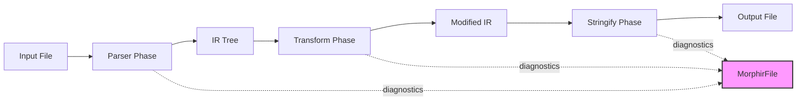

### Three-Phase Pipeline

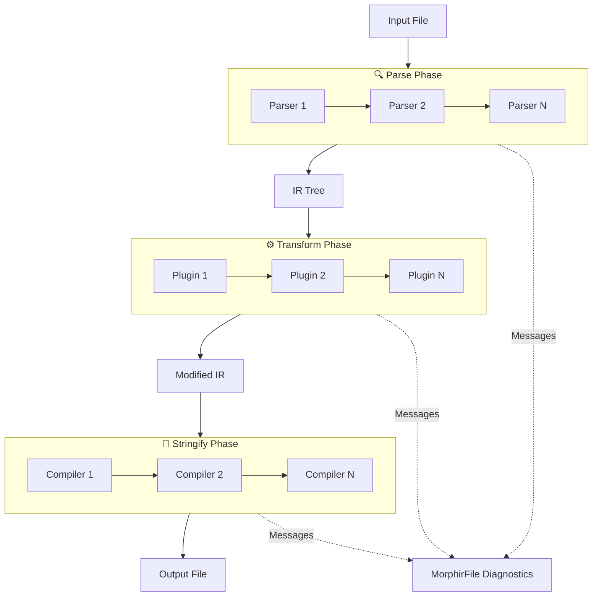

---

## 2. Component Architecture

### Core Components

```mermaid
graph TB
    subgraph Processor["MorphirProcessor"]
        direction TB
        PP[Parsers: Parser list]
        PL[Plugins: Plugin list]
        PC[Compilers: Compiler list]
        PF[Frozen: bool]
        PD[Data: Dictionary]
    end

    subgraph File["MorphirFile"]
        direction TB
        FC[Content: IRNode?]
        FP[Path: string?]
        FH[History: string list]
        FM[Messages: Message list]
        FD[Data: Dictionary]
    end

    subgraph Plugin["Plugin"]
        direction TB
        PN[Name: string]
        PCF[Configure: Processor → Processor]
        PT[Transform: Node → File → (Node?, File)]
    end

    Processor -->|processes| File
    Processor -->|contains| Plugin
    Plugin -->|transforms| File
```

### Type Relationships

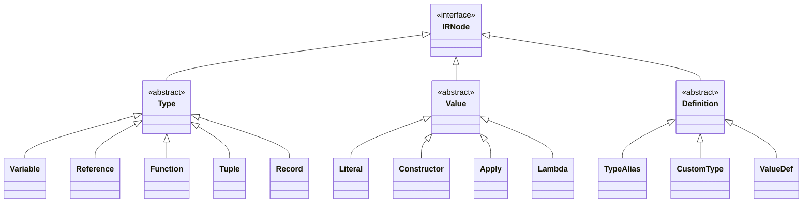

---

## 3. Plugin Execution Flow

### Plugin Chain Execution

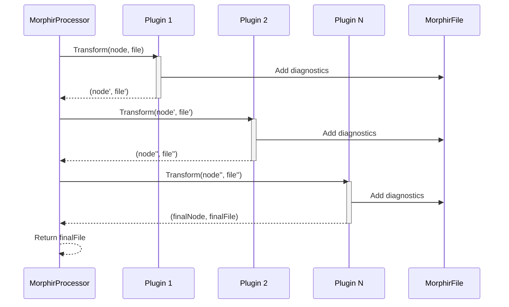

### Plugin Transform Logic

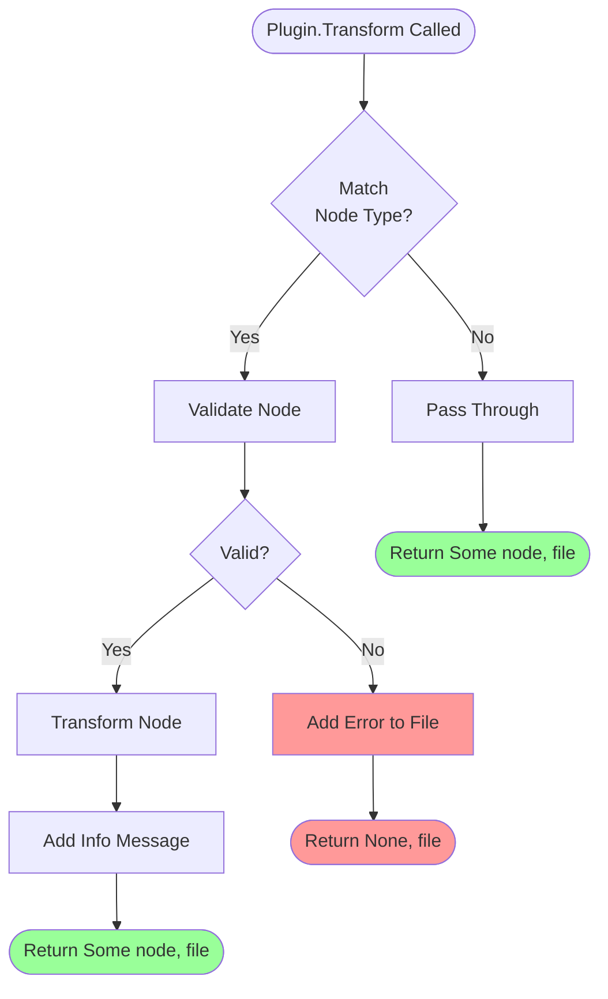

---

## 4. MorphirFile State Transitions

### Message Accumulation

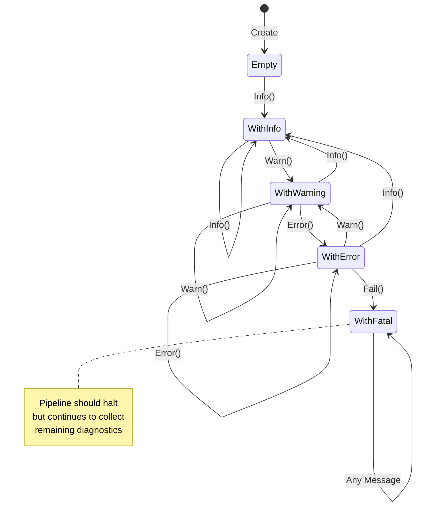

### Severity Levels

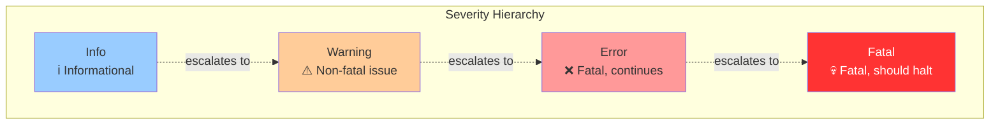

---

## 5. Processor Freezing

### Frozen vs Unfrozen

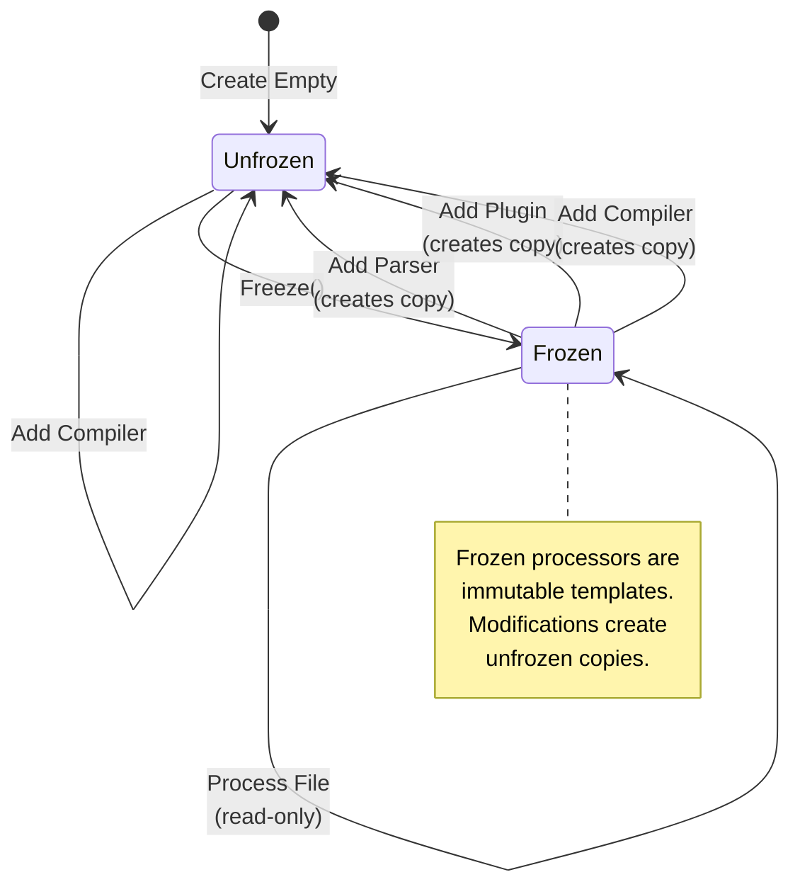

### Processor Variants

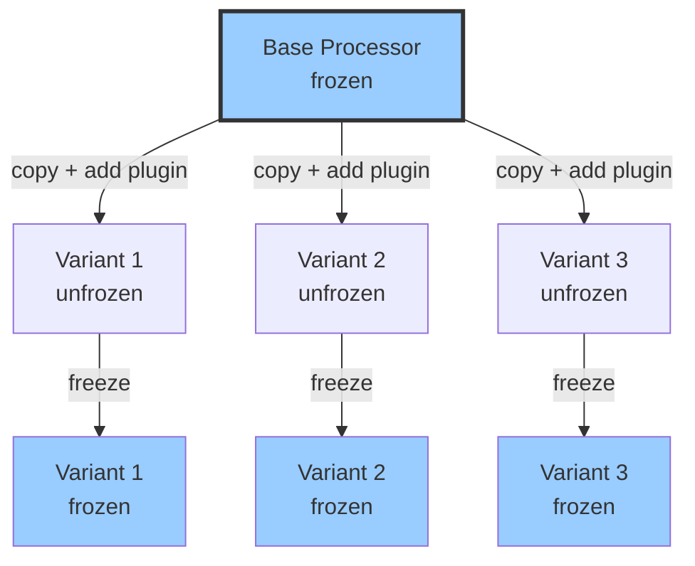

---

## 6. Class Diagrams

### MorphirFile Class Diagram

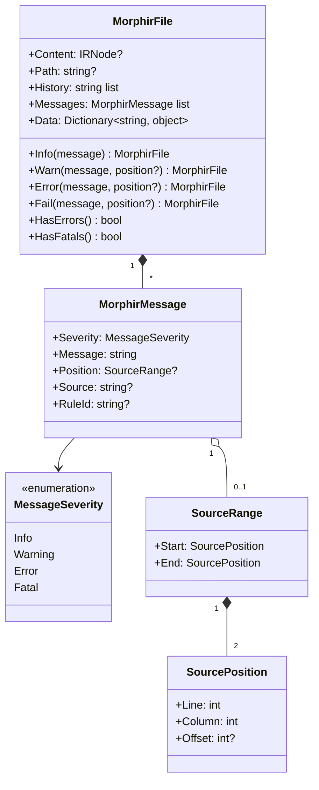

### MorphirProcessor Class Diagram

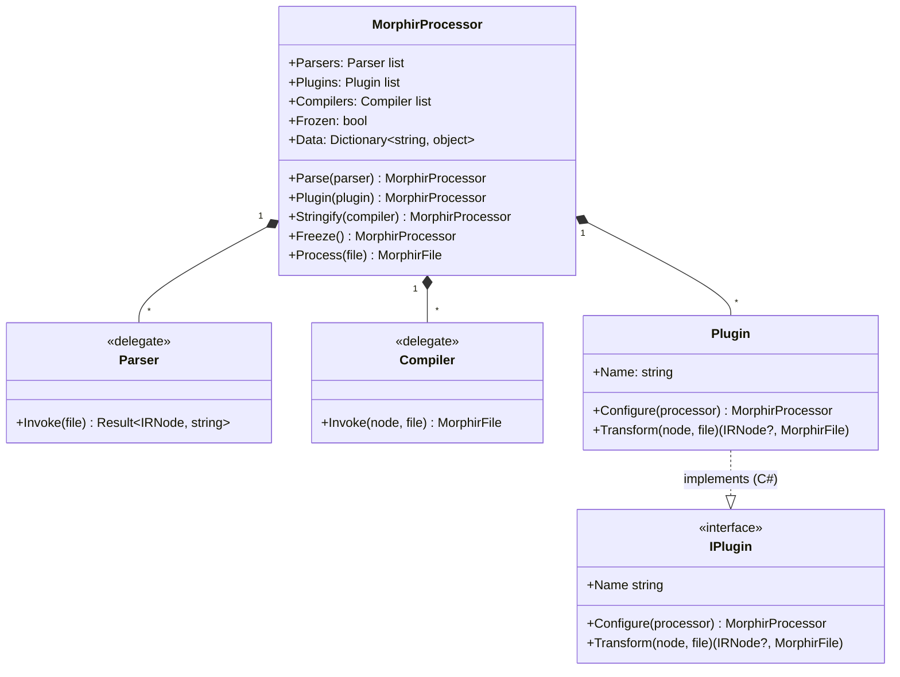

---

## 7. Sequence Diagrams

### Full Pipeline Execution

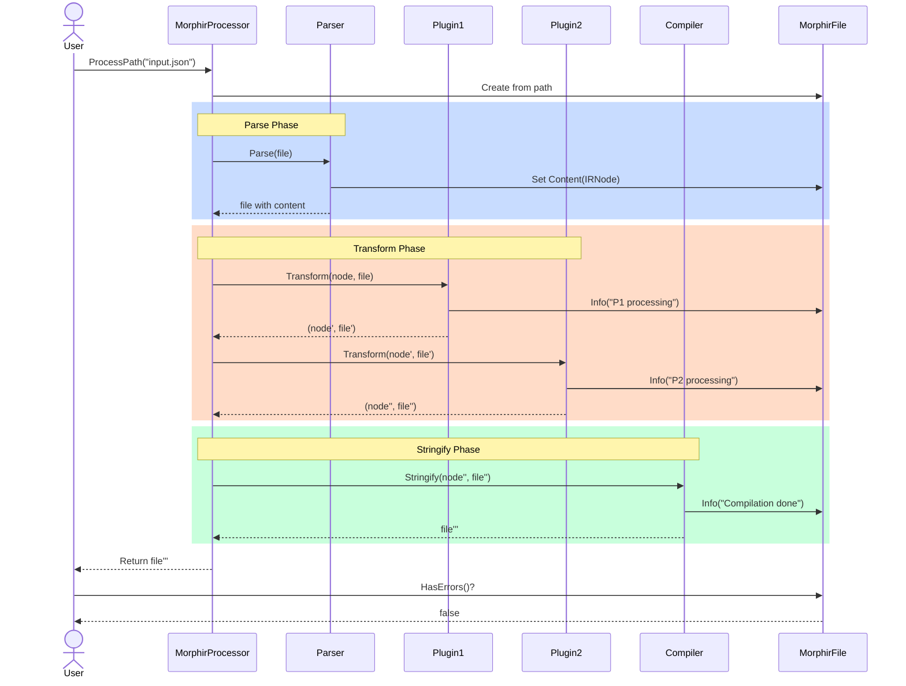

### Error Accumulation

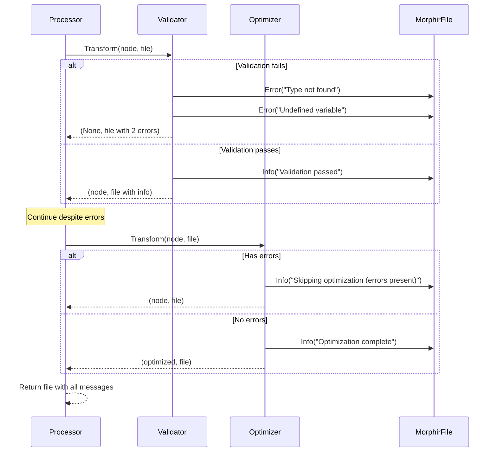

### Processor Freezing Flow

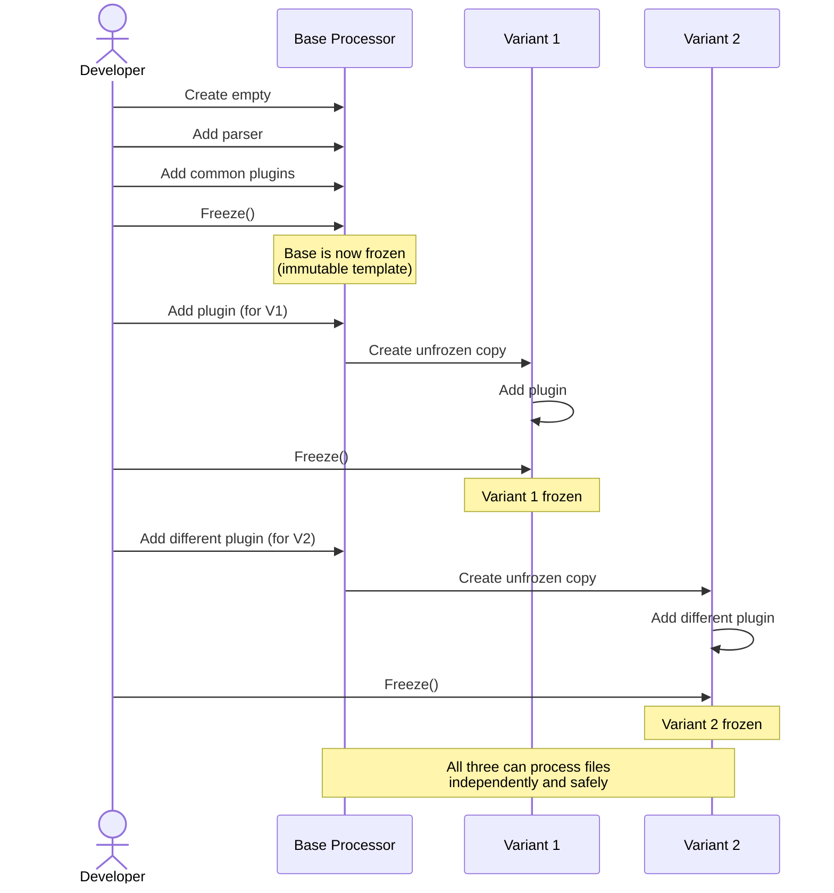

---

## Summary

This document provides comprehensive visual documentation of the pluggable pipeline architecture through:

1. **Pipeline Overview**: High-level flow and three-phase architecture
2. **Component Architecture**: Core components and type hierarchies
3. **Plugin Execution**: How plugins transform nodes and accumulate diagnostics
4. **MorphirFile States**: Message accumulation and severity levels
5. **Processor Freezing**: Immutable templates and variant creation
6. **Class Diagrams**: Detailed type structures and relationships
7. **Sequence Diagrams**: Runtime execution flows and interactions

These diagrams support the ADR-026 decision and API design document, providing visual reference for implementation.

---

**Related Documents**:
- ADR-026: Pluggable Pipeline Architecture
- API Design Document
- Task 2.1 Research: unified.js architecture

**Status**: Proposed
**Created**: 2025-12-26
