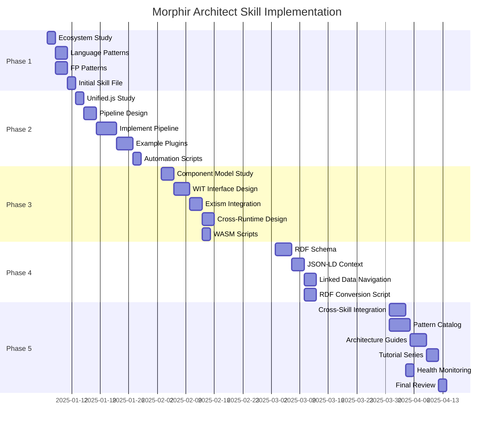

# Implementation Plan: Morphir Application Architect Skill

**PRD Reference**: [Morphir Application Architect Skill PRD](../prds/morphir-application-architect-skill.md)
**Status**: Planning
**Start Date**: TBD
**Target Completion**: 20 weeks from start
**Owner**: morphir-dotnet maintainers

## Overview

This implementation plan breaks down the creation of the Morphir Application Architect skill into executable tasks across 5 phases. Each task includes:
- Clear acceptance criteria
- Estimated effort
- Dependencies
- Assignable to AI or human agents

## Phase 1: Core Architectural Guidance (Weeks 1-4)

**Goal**: Establish foundational knowledge and core competencies

### Task 1.1: Morphir Ecosystem Documentation Review
**Effort**: 2 days
**Priority**: P0
**Prerequisites**: None

**Activities**:
1. Read all documentation from morphir-elm repository
   - IR format specifications (v1, v2, v3)
   - Type system documentation
   - SDK documentation
2. Read morphir-core documentation
   - Core concepts
   - Tooling architecture
   - CLI documentation
3. Document cross-repository patterns
4. Create ecosystem knowledge base

**Deliverables**:
- [ ] Ecosystem knowledge summary (markdown)
- [ ] Cross-repository pattern catalog
- [ ] Version compatibility matrix
- [ ] Architectural decision log

**Acceptance Criteria**:
- Can answer 95%+ of questions about Morphir ecosystem
- Can identify architectural patterns across all repositories
- Knowledge base contains 50+ entries

### Task 1.2: Language Design Pattern Research
**Effort**: 3 days
**Priority**: P0
**Prerequisites**: None

**Activities**:
1. Study AST/CST design patterns
   - Research compiler design literature
   - Analyze existing Morphir IR structure
   - Document transformation patterns
2. Research visitor pattern implementations
   - Gang of Four visitor pattern
   - Modern functional visitor alternatives
   - F#/C# idiomatic implementations
3. Document type system design patterns
4. Create pattern examples

**Deliverables**:
- [ ] AST/CST pattern guide
- [ ] Visitor pattern implementations (3+ variants)
- [ ] Type system design patterns document
- [ ] Code examples for each pattern

**Acceptance Criteria**:
- 10+ language design patterns documented
- 3+ working visitor pattern implementations
- Examples tested and verified

### Task 1.3: Functional Programming Pattern Library
**Effort**: 3 days
**Priority**: P0
**Prerequisites**: None

**Activities**:
1. Document core FP patterns
   - Monads, functors, applicatives
   - Lenses and optics
   - Free monads for DSLs
   - Railway-oriented programming
2. Create F# implementations
3. Create C# implementations (where applicable)
4. Document bridging patterns (FP ↔ OO)
   - Visitor pattern as bridge
   - Adapter pattern for FP in OO
   - Strategy pattern with FP

**Deliverables**:
- [ ] FP pattern catalog (15+ patterns)
- [ ] F# implementation examples
- [ ] C# implementation examples (where applicable)
- [ ] Bridging pattern guide

**Acceptance Criteria**:
- 15+ FP patterns documented with examples
- Each pattern has F# and (where applicable) C# example
- Bridging patterns tested with real code

### Task 1.4: Create Initial Skill File
**Effort**: 2 days
**Priority**: P0
**Prerequisites**: Tasks 1.1, 1.2, 1.3

**Activities**:
1. Use skill template
2. Populate core competencies section
3. Add initial decision trees
4. Create README and MAINTENANCE files
5. Set up directory structure

**Deliverables**:
- [ ] `.claude/skills/morphir-architect/skill.md`
- [ ] `.claude/skills/morphir-architect/README.md`
- [ ] `.claude/skills/morphir-architect/MAINTENANCE.md`
- [ ] `.claude/skills/morphir-architect/metadata.yaml`
- [ ] Directory structure created

**Acceptance Criteria**:
- Skill file follows template structure
- All required sections populated
- Passes skill validation checks
- README provides clear quick-start

## Phase 2: Pluggable Pipeline Architecture (Weeks 5-8)

**Goal**: Design and implement pluggable transformation pipeline inspired by unified.js

### Task 2.1: Unified.js Architecture Study
**Effort**: 2 days
**Priority**: P0
**Prerequisites**: Phase 1 complete

**Activities**:
1. Deep dive into unified.js source code
   - Processor architecture
   - Plugin interface design
   - Middleware chain implementation
2. Study unist specification
   - Universal syntax tree structure
   - Position tracking
   - Metadata attachment
3. Study vfile architecture
   - Virtual file abstraction
   - Metadata management
   - Message reporting
4. Document key architectural insights

**Deliverables**:
- [ ] Unified.js architecture analysis document
- [ ] Unist specification summary
- [ ] VFile pattern analysis
- [ ] Adaptation strategy for .NET/F#

**Acceptance Criteria**:
- Complete understanding of unified.js architecture
- Documented differences between JS and .NET approaches
- Clear adaptation strategy for F#/C#

### Task 2.2: Pipeline Architecture Design (ADR)
**Effort**: 3 days
**Priority**: P0
**Prerequisites**: Task 2.1

**Activities**:
1. Design processor architecture
   - F# computation expression for pipeline
   - Plugin registration mechanism
   - Middleware chain execution
2. Design plugin interface
   - Transformation plugin API
   - Parser plugin API
   - Generator plugin API
3. Design metadata system
   - IR node annotation
   - Provenance tracking
   - Error reporting
4. Write ADR documenting decisions

**Deliverables**:
- [ ] ADR for pluggable pipeline architecture
- [ ] API design document
- [ ] Interface definitions (F# and C#)
- [ ] Architecture diagrams (Mermaid/PlantUML)

**Acceptance Criteria**:
- ADR approved by maintainers
- API design reviewed and validated
- Diagrams clearly illustrate architecture
- Interface definitions are type-safe and extensible

### Task 2.3: Implement Core Pipeline
**Effort**: 5 days
**Priority**: P0
**Prerequisites**: Task 2.2

**Activities**:
1. Implement processor core
   - Pipeline builder
   - Plugin registration
   - Execution engine
2. Implement base plugin interfaces
   - ITransformationPlugin
   - IParserPlugin
   - IGeneratorPlugin
3. Implement metadata system
   - NodeMetadata type
   - Attachment/retrieval API
4. Create unit tests

**Deliverables**:
- [ ] `src/Morphir.Pipeline.Core/Processor.fs`
- [ ] `src/Morphir.Pipeline.Core/Plugin.fs`
- [ ] `src/Morphir.Pipeline.Core/Metadata.fs`
- [ ] Unit tests (>90% coverage)

**Acceptance Criteria**:
- All interfaces implemented
- Unit tests passing
- AOT-compatible (no reflection)
- Documented with XML comments

### Task 2.4: Create Example Plugins
**Effort**: 4 days
**Priority**: P1
**Prerequisites**: Task 2.3

**Activities**:
1. Type validator plugin
   - Validates Morphir IR type correctness
   - Reports type errors with context
2. Optimization plugin
   - Performs simple IR optimizations
   - Constant folding, dead code elimination
3. Pretty printer plugin
   - Generates human-readable IR representation

**Deliverables**:
- [ ] Type validator plugin with tests
- [ ] Optimization plugin with tests
- [ ] Pretty printer plugin with tests
- [ ] Plugin development guide

**Acceptance Criteria**:
- All plugins working end-to-end
- Tests demonstrate plugin composition
- Development guide helps users create plugins
- Examples referenced in skill documentation

### Task 2.5: Pipeline Automation Script
**Effort**: 2 days
**Priority**: P1
**Prerequisites**: Task 2.4

**Activities**:
1. Create `validate-pipeline.fsx`
   - Validate pipeline configuration
   - Check plugin dependencies
   - Verify plugin compatibility
2. Create `analyze-pipeline-performance.fsx`
   - Measure transformation performance
   - Identify bottlenecks

**Deliverables**:
- [ ] `scripts/validate-pipeline.fsx`
- [ ] `scripts/analyze-pipeline-performance.fsx`
- [ ] Script documentation

**Acceptance Criteria**:
- Scripts save 500+ tokens vs manual validation
- Clear error messages for common issues
- Performance analysis actionable

## Phase 3: WebAssembly Integration Strategy (Weeks 9-12)

**Goal**: Design WebAssembly Component Model integration and Extism plugin architecture

### Task 3.1: Component Model Deep Dive
**Effort**: 3 days
**Priority**: P0
**Prerequisites**: Phase 2 complete

**Activities**:
1. Study WebAssembly Component Model specification
   - Component model concepts
   - Interface types
   - Canonical ABI
2. Study WIT (WebAssembly Interface Types)
   - Syntax and semantics
   - Type mappings
   - Import/export declarations
3. Study WAC (WebAssembly Compositions)
   - Component linking
   - Composition patterns
4. Document findings

**Deliverables**:
- [ ] Component Model study notes
- [ ] WIT language reference summary
- [ ] Canonical ABI mapping guide
- [ ] Component composition patterns

**Acceptance Criteria**:
- Deep understanding of Component Model
- Can design WIT interfaces for Morphir types
- Can map Morphir IR to Component Model types

### Task 3.2: Design WIT Interfaces for Morphir IR
**Effort**: 4 days
**Priority**: P0
**Prerequisites**: Task 3.1

**Activities**:
1. Design core IR types in WIT
   - Package, Module, Type, Value
   - Expression and pattern types
2. Design transformation interfaces
   - Validation, optimization, generation
3. Create example WIT files
4. Write ADR for interface design

**Deliverables**:
- [ ] `morphir-ir.wit` - Core IR types
- [ ] `morphir-transform.wit` - Transformation interfaces
- [ ] ADR for WIT interface design
- [ ] Type mapping documentation

**Acceptance Criteria**:
- WIT files are valid and compilable
- Complete mapping from Morphir IR to WIT
- ADR approved by maintainers
- Examples demonstrate cross-language use

### Task 3.3: Extism Integration Design
**Effort**: 3 days
**Priority**: P1
**Prerequisites**: Task 3.2

**Activities**:
1. Study Extism architecture
   - Plugin interface
   - Host SDK (.NET)
   - Plugin SDK (multiple languages)
2. Design Morphir plugin interface for Extism
3. Create proof-of-concept
   - Simple transformation in Rust
   - Host in morphir-dotnet
4. Document integration strategy

**Deliverables**:
- [ ] Extism integration design document
- [ ] Proof-of-concept Rust plugin
- [ ] .NET host integration code
- [ ] Plugin development guide

**Acceptance Criteria**:
- Proof-of-concept works end-to-end
- Clear path for multi-language plugins
- Performance acceptable for production
- Documentation enables plugin authors

### Task 3.4: Cross-Runtime Communication Strategy
**Effort**: 3 days
**Priority**: P1
**Prerequisites**: Task 3.3

**Activities**:
1. Design IR serialization for WASM boundary
   - Efficient binary format
   - Backwards compatibility
2. Design type marshalling
   - .NET ↔ WASM type mapping
   - Handle complex types (discriminated unions)
3. Design async operation support
   - Async transformations
   - Cancellation support
4. Create benchmarks

**Deliverables**:
- [ ] Serialization format specification
- [ ] Type marshalling guide
- [ ] Async operation design
- [ ] Performance benchmarks

**Acceptance Criteria**:
- Serialization format documented
- Benchmarks show acceptable overhead (<10%)
- Async operations work correctly
- Documentation complete

### Task 3.5: WebAssembly Automation Scripts
**Effort**: 2 days
**Priority**: P2
**Prerequisites**: Tasks 3.2, 3.3

**Activities**:
1. Create `generate-wit-interface.fsx`
   - Generate WIT from Morphir IR types
   - Validate generated WIT
2. Create `build-wasm-plugin.fsx`
   - Build WASM plugins from source
   - Run Extism plugin tests

**Deliverables**:
- [ ] `scripts/generate-wit-interface.fsx`
- [ ] `scripts/build-wasm-plugin.fsx`
- [ ] Script documentation

**Acceptance Criteria**:
- Scripts automate common WASM tasks
- Save 700+ tokens vs manual approach
- Error messages helpful

## Phase 4: Semantic Web Integration (Weeks 13-16)

**Goal**: Design RDF/JSON-LD integration for semantic attribution and linked data

### Task 4.1: RDF Schema Design
**Effort**: 4 days
**Priority**: P2
**Prerequisites**: Phase 3 complete

**Activities**:
1. Study existing ontologies
   - Schema.org
   - DOAP (Description of a Project)
   - SKOS (Simple Knowledge Organization System)
2. Design Morphir IR ontology
   - Core concepts (Package, Module, Type, Value)
   - Relationships (contains, references, extends)
   - Attributes (visibility, documentation)
3. Create RDF schema (Turtle format)
4. Create example RDF instances

**Deliverables**:
- [ ] Morphir IR ontology (morphir.ttl)
- [ ] Ontology documentation
- [ ] Example RDF instances (10+ examples)
- [ ] SPARQL query examples

**Acceptance Criteria**:
- Ontology validates with RDF tools
- Covers all Morphir IR concepts
- Examples demonstrate usefulness
- SPARQL queries work correctly

### Task 4.2: JSON-LD Context Design
**Effort**: 3 days
**Priority**: P2
**Prerequisites**: Task 4.1

**Activities**:
1. Design JSON-LD context for Morphir IR
   - Map IR JSON to RDF vocabulary
   - Add attribution metadata
   - Support provenance tracking
2. Create JSON-LD context file
3. Create example JSON-LD documents
4. Validate with JSON-LD tools

**Deliverables**:
- [ ] morphir-context.jsonld
- [ ] JSON-LD examples (10+ examples)
- [ ] Conversion guide (JSON → JSON-LD)
- [ ] Validation results

**Acceptance Criteria**:
- Context validates with JSON-LD tools
- Examples demonstrate attribution
- Conversion from existing IR works
- Documentation clear

### Task 4.3: Linked Data Navigation Design
**Effort**: 3 days
**Priority**: P2
**Prerequisites**: Task 4.2

**Activities**:
1. Design URI scheme for IR nodes
   - Package URIs
   - Module URIs
   - Type/Value URIs
2. Design content negotiation
   - JSON representation
   - RDF/Turtle representation
   - HTML representation
3. Create navigation API design
4. Document navigation patterns

**Deliverables**:
- [ ] URI scheme specification
- [ ] Content negotiation design
- [ ] Navigation API design
- [ ] Usage examples

**Acceptance Criteria**:
- URI scheme is hierarchical and dereferenceable
- Content negotiation supports 3+ formats
- API design enables graph traversal
- Examples demonstrate linked data benefits

### Task 4.4: RDF Conversion Script
**Effort**: 3 days
**Priority**: P2
**Prerequisites**: Tasks 4.1, 4.2

**Activities**:
1. Implement `rdf-converter.fsx`
   - Convert Morphir IR JSON to RDF
   - Generate JSON-LD from IR
   - Validate output
2. Add SPARQL query examples
3. Create usage guide

**Deliverables**:
- [ ] `scripts/rdf-converter.fsx`
- [ ] SPARQL query library (20+ queries)
- [ ] Conversion guide
- [ ] Example outputs

**Acceptance Criteria**:
- Script converts IR to RDF correctly
- SPARQL queries work on converted data
- Saves 600+ tokens vs manual conversion
- Documentation complete

## Phase 5: Integration and Documentation (Weeks 17-20)

**Goal**: Integrate with other skills, complete pattern catalog, finalize documentation

### Task 5.1: Cross-Skill Integration
**Effort**: 4 days
**Priority**: P0
**Prerequisites**: Phases 1-4 complete

**Activities**:
1. Coordinate with aot-guru
   - WASM compilation integration
   - AOT compatibility checks
2. Coordinate with elm-to-fsharp-guru
   - Transformation pipeline integration
   - Migration pattern sharing
3. Coordinate with technical-writer
   - Documentation review
   - Diagram creation
4. Coordinate with qa-tester
   - Architecture validation tests

**Deliverables**:
- [ ] Integration playbooks (4 playbooks)
- [ ] Cross-skill decision trees
- [ ] Handoff protocols documented
- [ ] Example multi-skill workflows

**Acceptance Criteria**:
- Clear integration points with each skill
- Playbooks tested with real scenarios
- Handoff protocols smooth
- Multi-skill examples work end-to-end

### Task 5.2: Complete Pattern Catalog
**Effort**: 5 days
**Priority**: P1
**Prerequisites**: Phases 1-4 complete

**Activities**:
1. Document 20+ architectural patterns
   - Visitor pattern variants
   - Transformation chain patterns
   - Plugin patterns
   - WASM integration patterns
   - Semantic attribution patterns
2. Create decision trees for pattern selection
3. Provide code examples for each pattern
4. Document pattern evolution

**Deliverables**:
- [ ] Pattern catalog (20+ patterns)
- [ ] Decision trees (5+ trees)
- [ ] Code examples (tested)
- [ ] Pattern evolution log

**Acceptance Criteria**:
- 20+ patterns documented
- Each pattern has working example
- Decision trees guide pattern selection
- Evolution tracked

### Task 5.3: Architecture Guides
**Effort**: 4 days
**Priority**: P1
**Prerequisites**: Task 5.2

**Activities**:
1. Write "Pluggable Pipeline Architecture" guide
2. Write "WebAssembly Integration" guide
3. Write "Semantic Web in Morphir" guide
4. Create architecture diagrams (Mermaid, PlantUML)

**Deliverables**:
- [ ] Pluggable pipeline guide
- [ ] WASM integration guide
- [ ] Semantic web guide
- [ ] 10+ architecture diagrams

**Acceptance Criteria**:
- Guides comprehensive and clear
- Each guide includes examples
- Diagrams illustrate key concepts
- Reviewed by technical-writer skill

### Task 5.4: Tutorial Series
**Effort**: 3 days
**Priority**: P1
**Prerequisites**: Task 5.3

**Activities**:
1. "Building Your First Transformation Plugin"
2. "Creating a WASM-Based Code Generator"
3. "Adding Semantic Attribution to IR"

**Deliverables**:
- [ ] Tutorial 1: Transformation plugin
- [ ] Tutorial 2: WASM generator
- [ ] Tutorial 3: Semantic attribution
- [ ] Tutorial code repositories

**Acceptance Criteria**:
- Tutorials step-by-step and clear
- Code in tutorials tested and working
- Beginners can follow tutorials
- Reviewed by technical-writer

### Task 5.5: Architecture Health Monitoring
**Effort**: 2 days
**Priority**: P1
**Prerequisites**: All other Phase 5 tasks

**Activities**:
1. Create `architecture-report.fsx`
   - Scan codebase for architecture violations
   - Check plugin compatibility
   - Verify semantic metadata presence
2. Integrate with CI/CD
3. Create health score dashboard

**Deliverables**:
- [ ] `scripts/architecture-report.fsx`
- [ ] CI/CD integration
- [ ] Health score metrics
- [ ] Report examples

**Acceptance Criteria**:
- Script generates comprehensive reports
- Saves 800+ tokens vs manual review
- Integrates with GitHub Actions
- Actionable recommendations

### Task 5.6: Final Documentation Review
**Effort**: 2 days
**Priority**: P0
**Prerequisites**: All Phase 5 tasks

**Activities**:
1. Review all skill documentation
2. Ensure consistency across all files
3. Update cross-references
4. Get final approval from technical-writer

**Deliverables**:
- [ ] Documentation review checklist
- [ ] Cross-reference validation
- [ ] Final approval sign-off
- [ ] Published documentation

**Acceptance Criteria**:
- No broken links
- Consistent terminology
- All examples tested
- Technical-writer approval

## Risk Management

### High-Priority Risks

#### Risk 1: WebAssembly Component Model Stability
**Likelihood**: Medium
**Impact**: High
**Mitigation**:
- Monitor Component Model specification changes
- Design abstractions to isolate from spec changes
- Maintain fallback to traditional WASM if needed

#### Risk 2: Performance of Pipeline Architecture
**Likelihood**: Low
**Impact**: High
**Mitigation**:
- Benchmark early and often
- Profile transformation chains
- Optimize hot paths
- Consider AOT compilation for plugins

#### Risk 3: RDF Library Compatibility
**Likelihood**: Medium
**Impact**: Medium
**Mitigation**:
- Evaluate multiple .NET RDF libraries early
- Design abstraction layer over RDF library
- Provide fallback to simple JSON-LD

### Medium-Priority Risks

#### Risk 4: Skill Complexity
**Likelihood**: Medium
**Impact**: Medium
**Mitigation**:
- Modular design allows partial adoption
- Clear separation of phases
- Comprehensive documentation
- Tutorial series for onboarding

#### Risk 5: Cross-Skill Coordination
**Likelihood**: Medium
**Impact**: Medium
**Mitigation**:
- Early coordination meetings
- Clear interfaces and contracts
- Integration testing
- Regular sync-ups

## Success Criteria

### Phase 1 Success Criteria
- [ ] 95%+ ecosystem question accuracy
- [ ] 10+ language design patterns documented
- [ ] 15+ FP patterns with examples
- [ ] Skill file approved

### Phase 2 Success Criteria
- [ ] Pipeline architecture ADR approved
- [ ] 3+ working transformation plugins
- [ ] Pipeline API documented
- [ ] Automation scripts save 500+ tokens

### Phase 3 Success Criteria
- [ ] WIT interfaces designed and validated
- [ ] Extism proof-of-concept working
- [ ] Cross-runtime communication documented
- [ ] WASM scripts save 700+ tokens

### Phase 4 Success Criteria
- [ ] RDF schema published
- [ ] JSON-LD context created
- [ ] 20+ SPARQL queries working
- [ ] RDF script saves 600+ tokens

### Phase 5 Success Criteria
- [ ] 4+ integration playbooks created
- [ ] 20+ patterns in catalog
- [ ] 3+ architecture guides published
- [ ] 3+ tutorials created
- [ ] Architecture health monitoring active

## Timeline



## Resource Requirements

### Human Resources
- **Architect/Designer**: 40 hours (design reviews, ADRs)
- **Developer**: 120 hours (implementation)
- **Technical Writer**: 20 hours (documentation review)
- **Reviewer**: 20 hours (code and documentation review)

### AI Agent Resources
- Can execute most implementation tasks
- Particularly suited for:
  - Documentation writing
  - Pattern catalog creation
  - Script development
  - Example creation

### Infrastructure
- GitHub repository for tracking
- CI/CD for automation scripts
- Documentation hosting (Hugo site)

## Next Steps

1. **Immediate** (This Week):
   - [ ] Create GitHub issues from this plan
   - [ ] Assign initial tasks
   - [ ] Set up project tracking board

2. **Short-term** (Next 2 Weeks):
   - [ ] Begin Phase 1 tasks
   - [ ] Schedule design review for pipeline architecture
   - [ ] Research RDF libraries

3. **Medium-term** (Next Month):
   - [ ] Complete Phase 1
   - [ ] Begin Phase 2
   - [ ] Coordinate with other skills

## Appendix: GitHub Issue Template

```markdown
## Issue Template: Morphir Architect Task

**Task ID**: [e.g., Task 1.1]
**Phase**: [e.g., Phase 1]
**Effort**: [e.g., 2 days]
**Priority**: [e.g., P0]

### Description
[Brief description of the task]

### Prerequisites
- [ ] [Prerequisite 1]
- [ ] [Prerequisite 2]

### Activities
1. [Activity 1]
2. [Activity 2]

### Deliverables
- [ ] [Deliverable 1]
- [ ] [Deliverable 2]

### Acceptance Criteria
- [ ] [Criterion 1]
- [ ] [Criterion 2]

### Links
- PRD: [Link to PRD]
- Implementation Plan: [Link to this document]

### Labels
`skill:architect`, `phase-N`, `priority-pN`
```

---

**Document Status**: Planning
**Next Review**: Weekly during implementation
**Owner**: morphir-dotnet maintainers
**Tracking**: GitHub Project Board (TBD)
