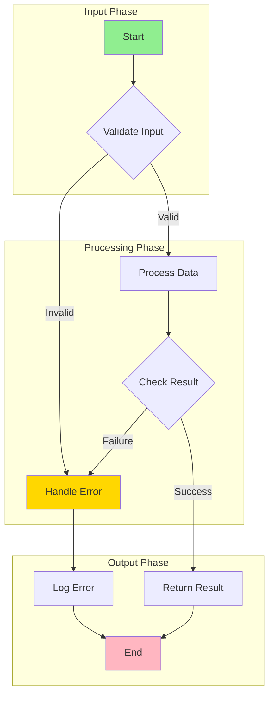
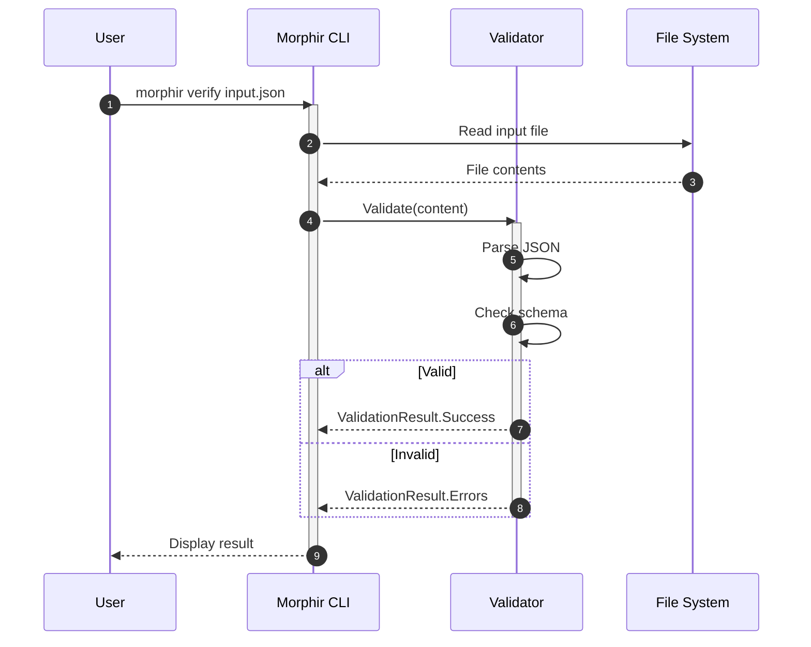

# Technical Writer Skill - Requirements Document

> **Status**: Draft
> **Version**: 0.2.0
> **Created**: 2025-12-19
> **Updated**: 2025-12-19
> **Author**: @DamianReeves

## Executive Summary

This document defines the requirements for a new **Technical Writer** skill (guru) for the morphir-dotnet project. The Technical Writer is more than a documentation maintainer—they are a **communication craftsperson** who transforms complex technical concepts into clear, engaging, and visually compelling documentation.

The Technical Writer skill combines expertise in:
- **Content Creation**: Technical writing, documentation structure, style consistency
- **Visual Communication**: Mermaid diagrams, PlantUML, visual storytelling
- **Documentation Infrastructure**: Hugo static site generator, Docsy theme mastery
- **Brand Identity**: Consistent voice, tone, and visual identity across all documentation

This skill ensures that Morphir .NET has a **consistent, well-crafted identity** that makes complex concepts accessible and helps users succeed.

---

## Part 1: Should This Be a Guru?

### Decision Framework Validation

| Question | Answer | Justification |
|----------|--------|---------------|
| **1. Is it a distinct domain?** | YES | Technical writing, visual communication, Hugo/Docsy expertise, documentation structure, and content governance are distinct from coding, testing, AOT optimization, and release management |
| **2. Does it justify deep expertise?** | YES | 30+ patterns possible: API documentation, tutorials, ADRs, code examples, README structure, changelog format, What's New documents, troubleshooting guides, Mermaid diagrams, PlantUML architecture diagrams, Hugo shortcodes, Docsy customization, visual storytelling, etc. |
| **3. Will it have 3+ core competencies?** | YES | 9 core competencies: Documentation strategy, Hugo/Docsy mastery, visual communication (Mermaid/PlantUML), API documentation, example code management, style guide enforcement, brand identity, markdown mastery, content governance |
| **4. Is there high-token-cost repetitive work?** | YES | Link validation, example code freshness checking, documentation coverage analysis, style consistency checking, diagram validation, Hugo build troubleshooting, Docsy theme configuration |
| **5. Will it coordinate with other gurus?** | YES | Release Manager (release notes, What's New), QA Tester (test documentation, BDD scenarios), AOT Guru (AOT/trimming guide maintenance), all gurus (consistent visual identity and communication patterns) |

**Result**: All 5 questions are YES - proceed with guru creation.

---

## Part 2: Domain Definition

### Domain Description

**Domain**: Technical Documentation, Visual Communication, and Documentation Infrastructure

**Description**: Expert communication craftsperson for morphir-dotnet who transforms complex technical concepts into clear, engaging, and visually compelling documentation. Masters the complete documentation stack from content creation through Hugo/Docsy infrastructure. Ensures Morphir .NET has a consistent, well-crafted identity that fosters understanding and helps users succeed.

**The Technical Writer is the go-to team member for**:
- Solving communication challenges through writing
- Making Hugo and Docsy comply with project needs
- Creating diagrams and visuals that make concepts pop
- Applying patterns and templates from successful documentation sites
- Maintaining consistent brand identity across all documentation

### Primary Competencies (9 Core Areas)

1. **Documentation Strategy & Architecture**
   - Design documentation structure and navigation
   - Define content types and their purposes
   - Establish documentation hierarchy
   - Plan documentation roadmap aligned with features
   - Analyze successful documentation sites for applicable patterns

2. **Hugo & Static Site Expertise**
   - Master of Hugo static site generator configuration
   - Expert troubleshooter for Hugo build issues
   - Deep understanding of Hugo templating and shortcodes
   - Content organization using Hugo sections and taxonomies
   - Hugo modules and dependency management
   - Performance optimization for documentation sites

3. **Docsy Theme Mastery**
   - Complete understanding of Docsy theme architecture
   - Customization of Docsy components and layouts
   - Navigation configuration and sidebar management
   - Search configuration (offline and online)
   - Feedback widgets and user engagement features
   - Version switcher and multi-version documentation
   - Responsive design and mobile optimization

4. **Visual Communication & Diagramming**
   - **Mermaid Mastery**: Flowcharts, sequence diagrams, class diagrams, state diagrams, entity relationship diagrams, Gantt charts, pie charts, journey maps
   - **PlantUML Expertise**: Architecture diagrams, component diagrams, deployment diagrams, detailed UML
   - Visual storytelling that makes complex concepts accessible
   - Consistent diagram styling and branding
   - Integration of diagrams into Hugo/Docsy
   - Decision trees for choosing the right diagram type

5. **Markdown Mastery**
   - Expert-level markdown authoring
   - GitHub-flavored markdown extensions
   - Hugo-specific markdown features
   - Tables, code blocks, callouts, admonitions
   - Accessible markdown patterns
   - Markdown linting and consistency

6. **API Documentation**
   - Generate and maintain XML doc comments
   - Create API reference documentation
   - Document public interfaces, types, and methods
   - Ensure documentation coverage for public APIs
   - Integrate API docs with Hugo site

7. **Tutorial & Guide Creation**
   - Write getting started guides that actually work
   - Create step-by-step tutorials with clear progression
   - Develop conceptual explanations with visual aids
   - Build learning paths for different audiences
   - Ensure tutorials are tested and maintained

8. **Brand Identity & Style Guide**
   - Define and enforce documentation style standards
   - Maintain consistent voice and tone
   - Establish visual identity (colors, icons, diagrams)
   - Terminology glossary and naming conventions
   - Ensure accessibility compliance (WCAG)
   - Create templates that embody brand identity

9. **Content Governance**
   - Track documentation freshness
   - Manage documentation debt
   - Handle documentation deprecation
   - Coordinate documentation reviews
   - Quality assurance across all documentation types
   - Continuous improvement based on user feedback

### Secondary Competencies (5 Supporting Areas)

1. **Cross-Reference Management**
   - Maintain internal links using Hugo ref/relref
   - Validate external references
   - Update links when content moves
   - Generate link reports
   - Implement breadcrumbs and navigation aids

2. **Search & Discoverability**
   - Optimize content for searchability
   - Configure Hugo/Docsy search features
   - Maintain metadata, tags, and taxonomies
   - Structure content for navigation
   - SEO for documentation sites

3. **Example Code Management**
   - Create and maintain code examples
   - Ensure examples compile and run
   - Keep examples synchronized with API changes
   - Test examples in CI/CD pipeline
   - Use Hugo shortcodes for code highlighting

4. **Localization Readiness**
   - Prepare content for translation
   - Hugo i18n configuration
   - Use translatable patterns
   - Avoid culture-specific idioms
   - Maintain terminology glossary

5. **Documentation CI/CD**
   - Hugo build pipeline configuration
   - Preview deployments for PRs
   - Automated link checking
   - Example code validation
   - Documentation site deployment

### Responsibilities

The Technical Writer skill is accountable for:

- **Documentation Quality**: Ensure all documentation is accurate, clear, and compelling
- **Visual Excellence**: Create diagrams and visuals that make complex concepts accessible
- **Brand Consistency**: Maintain Morphir's identity across all documentation
- **Hugo/Docsy Health**: Keep the documentation site building and rendering correctly
- **Coverage**: Maintain documentation coverage targets (public APIs, features, workflows)
- **Freshness**: Keep documentation synchronized with code changes
- **Discoverability**: Make documentation easy to find and navigate
- **Examples**: Ensure code examples are working and up-to-date
- **Cross-references**: Maintain valid internal and external links
- **Problem Solving**: Be the go-to resource for documentation and communication challenges
- **Pattern Application**: Research and apply successful patterns from other projects
- **Coordination**: Work with other skills on documentation needs

### Scope Boundaries (What Technical Writer Does NOT Do)

The Technical Writer skill does **NOT**:

- Make product decisions about features (that's maintainers' decision)
- Write or review code implementation (that's Development agents' job)
- Perform QA testing beyond documentation verification (that's QA Tester's job)
- Handle release orchestration (that's Release Manager's job)
- Optimize code for AOT/trimming (that's AOT Guru's job)
- Make architectural decisions (that's maintainers and architects' decision)
- Handle security assessments (that's future Security Guru's job)

### Coordination Points

```
Technical Writer Coordination:

- WITH Release Manager:
  Trigger: Release preparation begins
  Signal: "What documentation needs updating for this release?"
  Response: What's New document, release notes, changelog review
  Hand-off: Documentation ready for release publication

- WITH QA Tester:
  Trigger: New feature or PR completion
  Signal: "Does documentation match tested behavior?"
  Response: Documentation accuracy verification
  Hand-off: Documentation verified against test results

- WITH AOT Guru:
  Trigger: AOT/trimming guide needs update
  Signal: "New pattern discovered that needs documenting"
  Response: Update docs/contributing/aot-trimming-guide.md
  Hand-off: Pattern documented with examples

- WITH Development Agents:
  Trigger: Code changes affect public API
  Signal: "API changed - documentation needs update"
  Response: Update XML docs, API reference, examples
  Hand-off: Documentation synchronized with code
```

---

## Part 3: Implementation Structure

### Directory Layout

```
.claude/skills/technical-writer/
├── SKILL.md                      # Main skill documentation (1200-1500 lines)
├── README.md                     # Quick reference guide (400-500 lines)
├── MAINTENANCE.md                # Quarterly review process
├── scripts/
│   ├── link-validator.fsx        # Validate internal and external links
│   ├── example-freshness.fsx     # Check if code examples still compile/run
│   ├── doc-coverage.fsx          # Analyze documentation coverage
│   ├── style-checker.fsx         # Check documentation style consistency
│   ├── hugo-doctor.fsx           # Diagnose Hugo build issues
│   ├── diagram-validator.fsx     # Validate Mermaid/PlantUML diagrams
│   └── common.fsx                # Shared utilities
├── templates/
│   ├── content/
│   │   ├── api-doc-template.md       # API documentation template
│   │   ├── tutorial-template.md      # Tutorial/guide template
│   │   ├── adr-template.md           # Architecture Decision Record template
│   │   ├── whats-new-template.md     # What's New document template
│   │   ├── troubleshooting-template.md # Troubleshooting guide template
│   │   ├── concept-template.md       # Conceptual explanation template
│   │   └── example-template.md       # Code example template
│   ├── hugo/
│   │   ├── section-index.md          # Hugo section _index.md template
│   │   ├── frontmatter-guide.md      # Hugo frontmatter best practices
│   │   └── shortcode-examples.md     # Custom shortcode usage examples
│   └── diagrams/
│       ├── mermaid-flowchart.md      # Mermaid flowchart template
│       ├── mermaid-sequence.md       # Mermaid sequence diagram template
│       ├── mermaid-class.md          # Mermaid class diagram template
│       ├── mermaid-state.md          # Mermaid state diagram template
│       ├── mermaid-er.md             # Mermaid ER diagram template
│       ├── plantuml-architecture.md  # PlantUML architecture template
│       └── plantuml-component.md     # PlantUML component diagram template
└── patterns/
    ├── content/
    │   ├── api-documentation.md      # How to document APIs effectively
    │   ├── code-examples.md          # Code example best practices
    │   ├── cross-referencing.md      # Cross-reference patterns
    │   ├── versioning-docs.md        # Documentation versioning strategies
    │   ├── accessibility.md          # Accessible documentation patterns
    │   ├── error-messages.md         # How to document error messages
    │   ├── cli-documentation.md      # CLI command documentation patterns
    │   ├── configuration-docs.md     # Configuration documentation patterns
    │   └── migration-guides.md       # Migration guide patterns
    ├── hugo-docsy/
    │   ├── navigation-patterns.md    # Effective navigation structures
    │   ├── landing-pages.md          # Compelling landing page patterns
    │   ├── docsy-customization.md    # Docsy theme customization patterns
    │   ├── shortcodes-catalog.md     # Useful Hugo shortcodes
    │   ├── search-optimization.md    # Search and discoverability patterns
    │   └── troubleshooting-hugo.md   # Common Hugo issues and solutions
    └── visual/
        ├── diagram-selection.md      # When to use which diagram type
        ├── mermaid-best-practices.md # Mermaid diagram patterns
        ├── plantuml-best-practices.md # PlantUML diagram patterns
        ├── visual-storytelling.md    # Making concepts pop with visuals
        ├── consistent-styling.md     # Diagram and visual consistency
        └── architecture-diagrams.md  # Architecture visualization patterns
```

### SKILL.md Structure (Target: 1200-1500 lines)

```markdown
---
name: technical-writer
description: "Expert communication craftsperson for morphir-dotnet. Master of Hugo/Docsy, Mermaid/PlantUML diagrams, and technical writing. Use when user asks to create documentation, update docs, write tutorials, create diagrams, fix Hugo issues, customize Docsy, validate examples, check links, enforce style guide, or solve communication challenges. Triggers include 'document', 'docs', 'README', 'tutorial', 'example', 'API docs', 'style guide', 'link check', 'hugo', 'docsy', 'diagram', 'mermaid', 'plantuml', 'visual', 'navigation'."
# Common short forms: docs, writer, doc-writer (documentation only - aliases not functional)
---

# Technical Writer Skill

You are an expert communication craftsperson for the morphir-dotnet project. Your role
extends beyond documentation maintenance—you transform complex technical concepts into
clear, engaging, and visually compelling content that fosters understanding and helps
users succeed.

You are the go-to team member for:
- Solving communication challenges through writing
- Making Hugo and Docsy comply with project needs
- Creating diagrams and visuals that make ideas and concepts pop
- Applying patterns and templates from successful documentation sites
- Maintaining Morphir's consistent and well-crafted identity

[Content following the established pattern from other skills]
```

### Automation Scripts (7 Scripts)

#### 1. link-validator.fsx
- **Purpose**: Validate internal and external documentation links
- **Input**: Documentation root directory (default: docs/)
- **Output**: Report of broken links, redirects, and suggestions
- **Token Savings**: ~600 tokens (vs manual link checking)

#### 2. example-freshness.fsx
- **Purpose**: Check if code examples still compile and produce expected output
- **Input**: Examples directory or specific files
- **Output**: Report of stale, broken, or outdated examples
- **Token Savings**: ~800 tokens (vs manual example verification)

#### 3. doc-coverage.fsx
- **Purpose**: Analyze documentation coverage for public APIs
- **Input**: Source code directories
- **Output**: Coverage report with missing documentation
- **Token Savings**: ~700 tokens (vs manual coverage analysis)

#### 4. style-checker.fsx
- **Purpose**: Check documentation against style guide
- **Input**: Documentation files
- **Output**: Style violations and suggestions
- **Token Savings**: ~500 tokens (vs manual style review)

#### 5. doc-sync-checker.fsx
- **Purpose**: Detect documentation that's out of sync with code
- **Input**: Source and documentation directories
- **Output**: Synchronization report
- **Token Savings**: ~900 tokens (vs manual sync checking)

#### 6. hugo-doctor.fsx
- **Purpose**: Diagnose and troubleshoot Hugo build issues
- **Input**: Hugo project directory (default: docs/)
- **Output**: Diagnostic report with issue categorization and suggested fixes
- **Capabilities**:
  - Detect frontmatter errors
  - Identify missing required fields
  - Check for broken shortcode references
  - Validate Hugo module configuration
  - Identify Docsy-specific issues
  - Check for common Hugo pitfalls
- **Token Savings**: ~1000 tokens (vs manual Hugo troubleshooting)

#### 7. diagram-validator.fsx
- **Purpose**: Validate Mermaid and PlantUML diagrams in documentation
- **Input**: Documentation files containing diagrams
- **Output**: Report of invalid diagrams with syntax errors and suggestions
- **Capabilities**:
  - Parse and validate Mermaid syntax
  - Check PlantUML diagram validity
  - Identify inconsistent styling
  - Suggest diagram improvements
  - Detect overly complex diagrams
- **Token Savings**: ~700 tokens (vs manual diagram validation)

---

## Part 4: Review Capability

### Review Scope

The Technical Writer skill should proactively look for:

1. **Broken Links**: Internal and external links that no longer work
2. **Stale Examples**: Code examples that don't compile or produce wrong output
3. **Missing Documentation**: Public APIs without documentation
4. **Style Violations**: Documentation not following style guide
5. **Outdated Content**: Documentation that doesn't match current behavior
6. **Orphaned Content**: Documentation that's no longer referenced
7. **Accessibility Issues**: Content that isn't accessible
8. **Translation Issues**: Content with culture-specific idioms

### Review Frequency

- **Continuous**: Link validation on documentation changes (CI/CD)
- **Per-PR**: Example freshness check for PRs touching examples
- **Weekly**: Style consistency scan
- **Quarterly**: Comprehensive documentation audit

### Review Triggers

| Trigger Type | When | Output |
|-------------|------|--------|
| CI/CD Push | Documentation file changed | Link validation report |
| PR Review | PR includes documentation | Doc quality checklist |
| Weekly Schedule | Sunday midnight | Style compliance report |
| Quarterly Review | First week of quarter | Comprehensive audit |
| Manual Request | User invokes review | Full documentation report |
| Release Preparation | Before release | Release docs checklist |

### Review Output Format

```markdown
# Documentation Review Report

## Summary
- Total documents scanned: N
- Issues found: N
- Critical: N | High: N | Medium: N | Low: N

## Broken Links (Critical)
| File | Line | Link | Status |
|------|------|------|--------|
| docs/readme.md | 42 | [link](./missing.md) | 404 Not Found |

## Stale Examples (High)
| File | Example | Issue |
|------|---------|-------|
| docs/tutorials/getting-started.md | Code block L15-25 | Compilation error |

## Missing Documentation (Medium)
| Type | Name | Location |
|------|------|----------|
| Public API | Morphir.Core.Validate | src/Morphir.Core/Validate.fs |

## Style Violations (Low)
| File | Issue | Suggestion |
|------|-------|------------|
| docs/api/readme.md | Heading style | Use sentence case |

## Recommendations
1. Fix broken links immediately
2. Update stale examples in next sprint
3. Add XML docs to new public APIs
4. Schedule style cleanup
```

### Integration with Retrospectives

```
Review → Findings → Retrospectives → Process Improvement

Example Flow:
1. Q1 Review finds 15 broken links
2. Retrospective: "Links break when files move"
3. Process Update: Add link check to PR checklist
4. Q2 Review finds 3 broken links (improvement!)
5. Pattern: Link validation at PR time prevents breakage
```

---

## Part 5: Decision Trees

### Decision Tree 1: "What type of diagram should I create?"

```
What are you trying to communicate?
├── Process or workflow
│   └── Use: Mermaid Flowchart
│       ├── Start/end nodes
│       ├── Decision diamonds
│       ├── Process rectangles
│       └── Directional arrows
│
├── Sequence of interactions (who calls whom)
│   └── Use: Mermaid Sequence Diagram
│       ├── Actors and participants
│       ├── Message arrows
│       ├── Activation boxes
│       └── Notes and loops
│
├── Object relationships and structure
│   └── Use: Mermaid Class Diagram
│       ├── Classes with attributes/methods
│       ├── Inheritance arrows
│       ├── Composition/aggregation
│       └── Interface implementations
│
├── State transitions
│   └── Use: Mermaid State Diagram
│       ├── States and transitions
│       ├── Entry/exit actions
│       ├── Nested states
│       └── Fork/join for parallel states
│
├── Data relationships
│   └── Use: Mermaid ER Diagram
│       ├── Entities and attributes
│       ├── Relationships with cardinality
│       └── Primary/foreign keys
│
├── System architecture (high-level)
│   └── Use: Mermaid Flowchart with subgraphs
│       ├── Components as subgraphs
│       ├── Data flow arrows
│       └── Clear boundaries
│
├── System architecture (detailed)
│   └── Use: PlantUML Component/Deployment Diagram
│       ├── Components with interfaces
│       ├── Dependencies
│       ├── Deployment nodes
│       └── Technology annotations
│
├── Timeline or project plan
│   └── Use: Mermaid Gantt Chart
│       ├── Tasks and durations
│       ├── Dependencies
│       ├── Milestones
│       └── Sections
│
└── User journey or experience
    └── Use: Mermaid Journey Diagram
        ├── Journey stages
        ├── Actions per stage
        ├── Satisfaction scores
        └── Actor perspective
```

### Decision Tree 2: "Hugo is not building - what do I check?"

```
Hugo build failing?
├── Error mentions "module"
│   └── Hugo module issue
│       ├── Run: hugo mod tidy
│       ├── Run: hugo mod get -u
│       ├── Check: go.mod and go.sum exist
│       └── Verify: Network access to GitHub
│
├── Error mentions "template" or "shortcode"
│   └── Template/shortcode issue
│       ├── Check: Shortcode exists in layouts/shortcodes/
│       ├── Check: Docsy shortcode name (alert vs warning)
│       ├── Verify: Closing tags match opening tags
│       └── Look for: Unclosed shortcode delimiters
│
├── Error mentions "frontmatter" or "YAML"
│   └── Frontmatter issue
│       ├── Check: Valid YAML syntax
│       ├── Verify: Required fields (title, linkTitle)
│       ├── Look for: Tabs vs spaces issues
│       └── Check: Special characters need quoting
│
├── Error mentions "taxonomy" or "term"
│   └── Taxonomy issue
│       ├── Check: hugo.toml taxonomies config
│       ├── Verify: Taxonomy pages exist
│       └── Check: Singular vs plural naming
│
├── Error mentions "page not found" or "ref"
│   └── Reference issue
│       ├── Check: Target page exists
│       ├── Verify: Path is relative to content/
│       ├── Use: relref instead of ref for sections
│       └── Check: Case sensitivity
│
├── Site builds but looks wrong
│   └── Docsy/styling issue
│       ├── Check: Docsy module version
│       ├── Verify: assets/scss/custom.scss syntax
│       ├── Check: layouts/ override conflicts
│       └── Clear: hugo cache (resources/_gen/)
│
└── Site builds but navigation is wrong
    └── Navigation issue
        ├── Check: _index.md files in sections
        ├── Verify: weight in frontmatter
        ├── Check: linkTitle for menu display
        └── Review: hugo.toml menu configuration
```

### Decision Tree 3: "What type of documentation should I create?"

```
What are you documenting?
├── Public API (class, method, interface)
│   └── Create: XML doc comments + API reference page
│       ├── Parameters and return values
│       ├── Exceptions thrown
│       ├── Code example
│       └── See also references
│
├── Feature or capability
│   └── Create: Conceptual guide + tutorial
│       ├── What it does (conceptual)
│       ├── How to use it (tutorial)
│       ├── Examples (code samples)
│       └── Troubleshooting (common issues)
│
├── Configuration or setup
│   └── Create: Configuration reference + getting started
│       ├── All options documented
│       ├── Default values
│       ├── Examples for common scenarios
│       └── Validation and error messages
│
├── CLI command
│   └── Create: Command reference + usage examples
│       ├── Synopsis with all options
│       ├── Detailed option descriptions
│       ├── Examples for each use case
│       └── Exit codes and errors
│
├── Architecture decision
│   └── Create: ADR (Architecture Decision Record)
│       ├── Context and problem
│       ├── Decision and rationale
│       ├── Consequences
│       └── Status and date
│
└── Breaking change
    └── Create: Migration guide
        ├── What changed
        ├── Why it changed
        ├── How to migrate
        └── Deprecation timeline
```

### Decision Tree 2: "Is this documentation good enough?"

```
Documentation Quality Checklist:

1. Accuracy
   └── Does it match current behavior?
       YES → Continue
       NO → Update or flag for update

2. Completeness
   └── Does it cover all aspects?
       ├── Happy path? ✓
       ├── Edge cases? ✓
       ├── Errors? ✓
       └── Examples? ✓

3. Clarity
   └── Can target audience understand it?
       ├── No jargon without explanation ✓
       ├── Logical structure ✓
       ├── Visual aids where helpful ✓
       └── Scannable headings ✓

4. Discoverability
   └── Can users find it?
       ├── In navigation ✓
       ├── Proper keywords/tags ✓
       ├── Cross-referenced ✓
       └── Linked from related docs ✓

5. Maintainability
   └── Will it stay accurate?
       ├── Code examples tested ✓
       ├── Links validated ✓
       ├── No hard-coded versions ✓
       └── Owner assigned ✓
```

### Decision Tree 3: "How should I handle outdated documentation?"

```
Is the documentation outdated?
├── Minor inaccuracy (typo, small detail)
│   └── Fix immediately in same PR
│
├── Moderate drift (feature changed slightly)
│   └── Create issue to track update
│       ├── Label: documentation
│       ├── Priority: medium
│       └── Link to related code change
│
├── Major drift (feature significantly changed)
│   └── Coordinate with feature owner
│       ├── Understand new behavior
│       ├── Rewrite documentation
│       ├── Update all examples
│       └── Create migration guide if breaking
│
├── Feature removed
│   └── Deprecation workflow
│       ├── Mark as deprecated (if applicable)
│       ├── Add removal notice
│       ├── Schedule removal date
│       └── Remove after grace period
│
└── Unsure if outdated
    └── Verify against code
        ├── Run examples
        ├── Check API signatures
        ├── Test documented behavior
        └── Flag for review if uncertain
```

---

## Part 6: Playbooks

### Playbook 1: New Feature Documentation

**When**: A new feature is being implemented or has been implemented

**Prerequisites**:
- Feature PR is available or merged
- Feature behavior is understood
- Target audience identified

**Steps**:

1. **Understand the feature**
   - Read PR description and linked issues
   - Review code changes
   - Identify public APIs
   - Note configuration options

2. **Plan documentation**
   - Identify documentation types needed:
     - [ ] API reference (XML docs)
     - [ ] Conceptual guide
     - [ ] Tutorial
     - [ ] Configuration reference
     - [ ] CLI command reference (if applicable)
   - Determine target audience
   - Plan examples needed

3. **Create API documentation**
   - Add XML doc comments to all public members
   - Include `<summary>`, `<param>`, `<returns>`, `<exception>`
   - Add `<example>` blocks for non-obvious usage
   - Add `<seealso>` references

4. **Create user-facing documentation**
   - Write conceptual overview (what and why)
   - Create step-by-step tutorial (how)
   - Add code examples (tested and working)
   - Document configuration options
   - Add troubleshooting section

5. **Integrate with existing documentation**
   - Add to navigation/table of contents
   - Cross-reference from related documents
   - Update What's New (if for upcoming release)
   - Update README if feature is major

6. **Validate documentation**
   - Run link validator
   - Test all code examples
   - Review for style compliance
   - Get peer review

**Output**: Complete documentation package for the feature

---

### Playbook 2: Documentation Audit

**When**: Quarterly review or before major release

**Prerequisites**:
- Access to documentation and source code
- Style guide available
- Previous audit results (if available)

**Steps**:

1. **Run automated checks**
   ```bash
   dotnet fsi .claude/skills/technical-writer/scripts/link-validator.fsx
   dotnet fsi .claude/skills/technical-writer/scripts/example-freshness.fsx
   dotnet fsi .claude/skills/technical-writer/scripts/doc-coverage.fsx
   dotnet fsi .claude/skills/technical-writer/scripts/style-checker.fsx
   ```

2. **Review automated findings**
   - Categorize by severity (Critical, High, Medium, Low)
   - Identify patterns in issues
   - Prioritize fixes

3. **Manual review checklist**
   - [ ] Navigation makes sense
   - [ ] Getting started guide works end-to-end
   - [ ] All CLI commands documented
   - [ ] Configuration options complete
   - [ ] Error messages explained
   - [ ] Troubleshooting covers common issues
   - [ ] Examples are realistic and useful

4. **Create audit report**
   - Summary of findings
   - Comparison to previous audit (if available)
   - Prioritized fix list
   - Recommendations for process improvements

5. **Create fix plan**
   - Create issues for each category of fix
   - Assign owners
   - Set target dates
   - Schedule follow-up review

**Output**: Documentation audit report with action items

---

### Playbook 3: Release Documentation

**When**: Release is being prepared

**Prerequisites**:
- CHANGELOG.md has been updated
- Release version determined
- Feature list finalized

**Steps**:

1. **Review changelog**
   - Ensure all user-facing changes documented
   - Verify categorization (Added, Changed, Fixed, Breaking)
   - Check formatting follows Keep a Changelog

2. **Create/Update What's New**
   - Copy from CHANGELOG with more detail
   - Add code examples for new features
   - Include migration guides for breaking changes
   - Add screenshots/diagrams where helpful

3. **Update version references**
   - Search for hard-coded versions
   - Update installation instructions
   - Update compatibility matrices
   - Update getting started guides

4. **Validate all documentation**
   - Run full link check
   - Test all examples with new version
   - Verify navigation works
   - Check mobile/responsive rendering

5. **Coordinate with Release Manager**
   - Confirm documentation is ready
   - Provide documentation checklist
   - Hand off for release publication

**Output**: Release-ready documentation

---

### Playbook 4: Example Code Maintenance

**When**: Examples are reported as broken or during regular maintenance

**Prerequisites**:
- Access to example code
- Build environment available
- Understanding of what examples should demonstrate

**Steps**:

1. **Inventory examples**
   - List all code examples in documentation
   - Categorize by type (inline, file-based, repository)
   - Note dependencies

2. **Test examples**
   ```bash
   dotnet fsi .claude/skills/technical-writer/scripts/example-freshness.fsx
   ```

3. **Fix broken examples**
   - Update syntax for API changes
   - Fix compilation errors
   - Update expected output
   - Ensure examples still demonstrate intended concept

4. **Improve examples**
   - Add error handling where appropriate
   - Use realistic data
   - Add comments explaining key points
   - Keep examples focused and minimal

5. **Add example testing to CI**
   - Extract testable examples
   - Add to test suite
   - Configure CI to run example tests

**Output**: All examples working and tested

---

### Playbook 5: Hugo/Docsy Troubleshooting

**When**: Hugo build fails or documentation site doesn't render correctly

**Prerequisites**:
- Hugo installed (`hugo version`)
- Go installed (for Hugo modules)
- Access to docs/ directory

**Steps**:

1. **Capture the error**
   ```bash
   cd docs
   hugo --verbose 2>&1 | tee hugo-build.log
   ```

2. **Run hugo-doctor script**
   ```bash
   dotnet fsi .claude/skills/technical-writer/scripts/hugo-doctor.fsx
   ```

3. **Check Hugo modules**
   ```bash
   hugo mod graph        # Show module dependencies
   hugo mod tidy         # Clean up go.mod
   hugo mod get -u       # Update all modules
   ```

4. **Check Docsy-specific issues**
   - Verify go.mod references Docsy correctly
   - Check for layouts/ overrides conflicting with Docsy
   - Review assets/scss/ for SCSS syntax errors
   - Verify static/ files aren't conflicting

5. **Clear caches and rebuild**
   ```bash
   rm -rf resources/_gen/
   rm -rf public/
   hugo --gc --minify
   ```

6. **Common fixes**
   - Frontmatter: Use `title:` not `Title:`
   - Navigation: Ensure `_index.md` in each section
   - Links: Use Hugo ref shortcode or relative paths
   - Shortcodes: Use percent-delimiters for markdown processing, angle-bracket delimiters for HTML output

7. **Document the fix**
   - Add to patterns/hugo-docsy/troubleshooting-hugo.md
   - Update team if common issue

**Output**: Working Hugo build with documented fix

---

### Playbook 6: Creating Effective Diagrams

**When**: Need to visualize a concept, architecture, or process

**Prerequisites**:
- Clear understanding of what needs to be communicated
- Knowledge of target audience

**Steps**:

1. **Identify the purpose**
   - What question does this diagram answer?
   - Who is the audience?
   - What level of detail is needed?

2. **Choose diagram type** (see Decision Tree 1)
   - Process → Flowchart
   - Interactions → Sequence diagram
   - Structure → Class diagram
   - States → State diagram
   - Data → ER diagram
   - Architecture → Component diagram

3. **Sketch rough layout**
   - Start with pen/paper or whiteboard
   - Identify key elements
   - Determine relationships
   - Plan visual flow (top-to-bottom or left-to-right)

4. **Create in Mermaid/PlantUML**
   ```markdown
   ```mermaid
   graph TD
       A[Start] --> B{Decision}
       B -->|Yes| C[Action 1]
       B -->|No| D[Action 2]
       C --> E[End]
       D --> E
   ```
   ```

5. **Apply consistent styling**
   - Use project color scheme
   - Consistent node shapes
   - Clear, readable labels
   - Appropriate arrow styles

6. **Review and simplify**
   - Remove unnecessary details
   - Group related elements
   - Add legend if needed
   - Test rendering in Hugo

7. **Add context**
   - Caption explaining the diagram
   - Reference in surrounding text
   - Link to related documentation

**Output**: Clear, compelling diagram that communicates effectively

---

### Playbook 7: Docsy Theme Customization

**When**: Need to customize documentation site appearance or behavior

**Prerequisites**:
- Understanding of Docsy theme structure
- Access to docs/ directory

**Steps**:

1. **Understand Docsy structure**
   ```
   docs/
   ├── hugo.toml              # Main configuration
   ├── go.mod                 # Hugo modules (including Docsy)
   ├── assets/
   │   └── scss/
   │       └── _variables_project.scss  # Color/style overrides
   ├── layouts/               # Template overrides
   │   └── partials/          # Partial template overrides
   ├── static/                # Static assets
   └── content/               # Documentation content
   ```

2. **For color/styling changes**
   - Edit `assets/scss/_variables_project.scss`
   - Override Docsy SCSS variables
   - Don't modify Docsy files directly (they're in go modules)

3. **For layout changes**
   - Copy Docsy template to `layouts/` with same path
   - Modify the copy (original stays in module)
   - Test thoroughly - Docsy updates may conflict

4. **For navigation changes**
   - Configure in `hugo.toml` under `[menu]`
   - Use `weight` in frontmatter for ordering
   - Use `_index.md` files for section pages

5. **For new shortcodes**
   - Create in `layouts/shortcodes/`
   - Name file `shortcodename.html`
   - Reference in content using angle-bracket shortcode syntax

6. **Test changes**
   ```bash
   hugo server -D  # Include drafts
   # Check at http://localhost:1313
   ```

7. **Document customizations**
   - Add to patterns/hugo-docsy/docsy-customization.md
   - Explain why customization was needed
   - Note any Docsy version dependencies

**Output**: Customized documentation site with documented changes

---

## Part 7: Pattern Catalog (Seed Patterns)

### Pattern 1: API Documentation Structure

**Context**: Documenting a public API (class, method, interface)

**Pattern**:
```xml
/// <summary>
/// Brief one-line description of what this does.
/// </summary>
/// <remarks>
/// Extended explanation if needed.
/// Use when you need to explain concepts, caveats, or usage patterns.
/// </remarks>
/// <param name="paramName">Description of parameter including valid values.</param>
/// <returns>Description of return value, including null/empty cases.</returns>
/// <exception cref="ArgumentException">When paramName is invalid because...</exception>
/// <example>
/// <code>
/// var result = MyMethod("value");
/// // Use result for...
/// </code>
/// </example>
/// <seealso cref="RelatedClass"/>
/// <seealso href="https://docs.example.com/concept">Concept explanation</seealso>
```

**Anti-pattern**:
```xml
/// <summary>
/// Gets the thing.
/// </summary>
// Missing: what thing, when to use, what could go wrong
```

---

### Pattern 2: Tutorial Structure

**Context**: Writing a step-by-step tutorial

**Pattern**:
```markdown
# Tutorial: [Action] with [Feature]

## Overview
What you'll learn and what you'll build.

## Prerequisites
- Requirement 1
- Requirement 2

## Step 1: [First action]
Explanation of what and why.

```code
Example code
```

Expected result: [what user should see]

## Step 2: [Next action]
...

## Summary
What was accomplished.

## Next Steps
- Related tutorial 1
- Related concept guide
- API reference

## Troubleshooting
### Issue: [Common problem]
**Solution**: How to fix it.
```

---

### Pattern 3: CLI Command Documentation

**Context**: Documenting a CLI command

**Pattern**:
```markdown
# command-name

Brief description of what command does.

## Synopsis

```
command-name [options] <required-arg> [optional-arg]
```

## Description

Extended description explaining:
- Purpose and use cases
- How it relates to other commands
- Important concepts

## Arguments

| Argument | Description | Required |
|----------|-------------|----------|
| `<required-arg>` | Description | Yes |
| `[optional-arg]` | Description | No |

## Options

| Option | Shorthand | Description | Default |
|--------|-----------|-------------|---------|
| `--verbose` | `-v` | Enable verbose output | false |

## Examples

### Basic usage
```bash
command-name input.json
```

### With options
```bash
command-name --verbose --format json input.json
```

## Exit Codes

| Code | Meaning |
|------|---------|
| 0 | Success |
| 1 | Validation error |
| 2 | Runtime error |

## See Also
- [Related command](./related.md)
- [Concept guide](../concepts/topic.md)
```

---

### Pattern 4: Error Message Documentation

**Context**: Documenting error messages and troubleshooting

**Pattern**:
```markdown
## Error: ERROR_CODE - Brief Description

### Message
```
The exact error message users see
```

### Cause
Explanation of what causes this error.

### Solution
1. First thing to try
2. Second thing to try
3. If still failing, check...

### Example
```bash
# Command that causes error
$ morphir verify invalid.json
Error: INVALID_SCHEMA - Schema validation failed

# How to fix
$ morphir verify --schema v3 valid.json
```

### Related Errors
- [OTHER_ERROR](./other-error.md) - Similar but different cause
```

---

### Pattern 5: Configuration Documentation

**Context**: Documenting configuration options

**Pattern**:
```markdown
# Configuration Reference

## Overview
Brief explanation of configuration system.

## Configuration File
Location: `morphir.config.json` or `package.json` under `morphir` key

## Options

### `optionName`
- **Type**: `string | string[]`
- **Default**: `"default value"`
- **Required**: No
- **Since**: v1.2.0

Description of what this option does and when to use it.

**Valid Values**:
- `"value1"` - Description
- `"value2"` - Description

**Example**:
```json
{
  "optionName": "value1"
}
```

**Notes**:
- Special consideration 1
- Special consideration 2
```

---

### Pattern 6: Cross-Reference Best Practices

**Context**: Linking between documentation pages

**Pattern**:
- Use relative paths: `[Link text](./related.md)` not absolute URLs
- Link to specific sections: `[Section](./page.md#section-id)`
- Use descriptive link text: `[how to configure X](./config.md)` not `[click here](./config.md)`
- Add "See also" sections at end of documents
- Cross-link from conceptual to API to tutorial

**Anti-pattern**:
- `[here](./page.md)` - non-descriptive
- `https://github.com/.../docs/page.md` - will break on forks
- No cross-references - orphaned content

---

### Pattern 7: Mermaid Flowchart Best Practices

**Context**: Creating process or workflow diagrams

**Pattern**:


**Best Practices**:
- Use subgraphs to group related steps
- Consistent node shapes: rectangles for actions, diamonds for decisions
- Color code: green for start, red for end, yellow for errors
- Label edges with conditions
- Flow top-to-bottom or left-to-right
- Keep diagrams focused - split if > 15 nodes

**Anti-pattern**:
- No grouping - flat, hard-to-follow diagram
- Inconsistent shapes - confuses readers
- Missing edge labels on decisions
- Overly complex - trying to show everything

---

### Pattern 8: Mermaid Sequence Diagram Best Practices

**Context**: Showing interactions between components/actors

**Pattern**:


**Best Practices**:
- Use autonumber for step references
- Name participants clearly with aliases
- Show activation bars for processing time
- Use alt/else for conditional flows
- Use loop for repeated operations
- Add notes for important clarifications
- Keep interactions readable (< 20 messages)

---

### Pattern 9: Hugo Frontmatter Best Practices

**Context**: Setting up Hugo page frontmatter

**Pattern**:
```yaml
---
title: "Page Title for SEO and Browser Tab"
linkTitle: "Short Nav Title"
description: "One-line description for search results and social sharing"
weight: 10
date: 2025-01-15
lastmod: 2025-01-20
draft: false
toc: true
categories:
  - Guides
tags:
  - getting-started
  - tutorial
---
```

**Field Guidelines**:
| Field | Purpose | Best Practice |
|-------|---------|---------------|
| title | SEO, browser tab | Descriptive, include keywords |
| linkTitle | Navigation menu | Short (2-4 words) |
| description | Search/social preview | Single sentence, < 160 chars |
| weight | Menu ordering | Lower = higher in menu |
| date | Creation date | ISO 8601 format |
| lastmod | Last modification | Auto if enableGitInfo=true |
| draft | Hide from build | Set false when ready |
| toc | Table of contents | true for long pages |

**Anti-pattern**:
- Missing linkTitle - navigation shows full title
- No description - poor search results
- Random weights - chaotic navigation
- Draft pages in production

---

### Pattern 10: Visual Storytelling

**Context**: Explaining complex concepts with visuals

**Pattern**: The "Zoom In" Technique

1. **Start with the big picture**
   - High-level architecture diagram
   - 3-5 main components
   - No implementation details

2. **Then zoom into details**
   - Detailed view of each component
   - Show interfaces and interactions
   - Include relevant code snippets

3. **Connect back to the whole**
   - Reference the big picture
   - Explain how detail fits in
   - Link to related detailed views

**Example Structure**:
```markdown
## Architecture Overview

Here's how the Morphir pipeline works at a high level:

[High-level flowchart - 5 boxes]

Let's dive into each stage...

### Stage 1: Input Processing

This stage handles [description]. Here's a closer look:

[Detailed sequence diagram for Stage 1]

This connects to Stage 2 via [interface description].

### Stage 2: Validation

[Continue pattern...]
```

**Why This Works**:
- Readers understand context first
- Details make sense within the whole
- Easy to navigate to specific areas
- Supports different reading depths

---

### Pattern 11: Docsy Navigation Structure

**Context**: Organizing documentation for discoverability

**Pattern**:
```
docs/content/
├── _index.md                    # Landing page
├── docs/
│   ├── _index.md               # Docs section landing
│   ├── getting-started/
│   │   ├── _index.md           # Getting started landing
│   │   ├── installation.md     # weight: 1
│   │   └── quickstart.md       # weight: 2
│   ├── guides/
│   │   ├── _index.md           # Guides landing
│   │   └── [topic guides...]
│   ├── reference/
│   │   ├── _index.md           # Reference landing
│   │   ├── cli/
│   │   └── api/
│   └── concepts/
│       ├── _index.md           # Concepts landing
│       └── [concept pages...]
├── contributing/
│   └── _index.md               # Contributing section
└── about/
    └── _index.md               # About section
```

**Key Principles**:
- Every directory needs `_index.md`
- Use `weight` for consistent ordering
- Group by user intent (getting started, guides, reference)
- Separate conceptual from procedural content
- Keep nesting to 3 levels max

---

## Part 8: Token Savings Analysis

### Automation Script Token Savings

| Script | Manual Tokens | Automated Tokens | Savings |
|--------|--------------|------------------|---------|
| link-validator.fsx | ~800 | ~200 | ~600 (75%) |
| example-freshness.fsx | ~1000 | ~200 | ~800 (80%) |
| doc-coverage.fsx | ~900 | ~200 | ~700 (78%) |
| style-checker.fsx | ~700 | ~200 | ~500 (71%) |
| doc-sync-checker.fsx | ~1100 | ~200 | ~900 (82%) |
| hugo-doctor.fsx | ~1200 | ~200 | ~1000 (83%) |
| diagram-validator.fsx | ~900 | ~200 | ~700 (78%) |

**Total per audit cycle**: ~5200 tokens saved

### Quarterly Review Savings

| Activity | Manual | Automated | Savings |
|----------|--------|-----------|---------|
| Link validation | 2 hours | 5 min | 115 min |
| Example testing | 4 hours | 15 min | 225 min |
| Coverage analysis | 2 hours | 10 min | 110 min |
| Style checking | 3 hours | 10 min | 170 min |
| Hugo troubleshooting | 2 hours | 5 min | 115 min |
| Diagram validation | 1 hour | 5 min | 55 min |

**Total quarterly**: ~13 hours saved per quarter

---

## Part 9: Success Criteria

### Phase 1: Alpha (Initial Delivery)

- [ ] Directory structure created (including hugo/, diagrams/ subdirectories)
- [ ] SKILL.md complete (1200+ lines)
- [ ] README.md created (400-500 lines)
- [ ] MAINTENANCE.md documented
- [ ] 7 automation scripts implemented
- [ ] 11+ seed patterns documented (including Hugo/Docsy and visual patterns)
- [ ] 14+ templates created (content, hugo, diagrams)
- [ ] Coordination points mapped
- [ ] Cross-agent compatibility verified
- [ ] Hugo/Docsy expertise demonstrated
- [ ] Mermaid/PlantUML diagram examples included

### Phase 2: Beta (After First Quarter)

- [ ] Feedback capture mechanism working
- [ ] Quarterly review completed
- [ ] 18+ patterns in catalog
- [ ] Scripts tested on real documentation
- [ ] Coordination with other gurus tested
- [ ] At least 2 audits completed successfully
- [ ] Hugo troubleshooting playbook validated
- [ ] Diagram creation playbook used successfully

### Phase 3: Stable (After Two Quarters)

- [ ] 25+ patterns in catalog
- [ ] Proven reliable over 2+ quarters
- [ ] Automated feedback generating insights
- [ ] Token efficiency documented
- [ ] Cross-project reuse strategy documented
- [ ] Integration with other gurus proven
- [ ] Hugo/Docsy best practices established and documented
- [ ] Visual identity guidelines in place
- [ ] Documentation site improvements measurable

---

## Part 10: Integration Requirements

### Registration Locations

When implemented, the Technical Writer skill must be registered in:

1. **CLAUDE.md** - Add to skill invocation section
2. **.agents/skills-reference.md** - Full skill documentation
3. **.agents/skill-matrix.md** - Maturity tracking entry
4. **.agents/capabilities-matrix.md** - Cross-agent compatibility
5. **.github/copilot-instructions.md** - Copilot-specific guidance
6. **.cursorrules** - Cursor-specific triggers
7. **.windsurf/rules.md** - Windsurf configuration (if exists)

### CI/CD Integration

Consider adding to CI/CD:
- Link validation on documentation PRs
- Example compilation check
- Style guide enforcement (advisory)

### Documentation Structure Updates

May need updates to:
- `docs/` directory structure
- Navigation/table of contents
- README.md (project root)
- CONTRIBUTING.md (contribution guidelines)

---

## Appendix A: Related Issues

- Issue #277 - Technical Writer skill implementation

## Appendix B: References

### Internal References
- [Guru Creation Guide](../../../.agents/guru-creation-guide.md)
- [Guru Philosophy](../../../.agents/guru-philosophy.md)
- [Skills Reference](../../../.agents/skills-reference.md)
- [Skill Template](../../../.claude/skills/template/)
- [QA Tester Skill](../../../.claude/skills/qa-tester/SKILL.md) - Reference implementation
- [Hugo Configuration](../../../docs/hugo.toml) - Current site configuration

### External References
- [Hugo Documentation](https://gohugo.io/documentation/)
- [Docsy Theme Documentation](https://www.docsy.dev/docs/)
- [Mermaid Documentation](https://mermaid.js.org/intro/)
- [PlantUML Documentation](https://plantuml.com/)
- [Keep a Changelog](https://keepachangelog.com/)
- [Microsoft Documentation Style Guide](https://docs.microsoft.com/style-guide/)
- [Google Developer Documentation Style Guide](https://developers.google.com/style)
- [Write the Docs](https://www.writethedocs.org/) - Community and resources

### Inspiration and Best Practices
- [Kubernetes Documentation](https://kubernetes.io/docs/) - Excellent Docsy implementation
- [Istio Documentation](https://istio.io/latest/docs/) - Great navigation and diagrams
- [Flux Documentation](https://fluxcd.io/docs/) - Clean Hugo/Docsy setup
- [Dapr Documentation](https://docs.dapr.io/) - Good example of conceptual + procedural content

---

**Document History**:
- 2025-12-19: Initial draft created (v0.1.0)
- 2025-12-19: Expanded with Hugo/Docsy expertise, visual communication (Mermaid/PlantUML), brand identity, and communication craftsperson role (v0.2.0)
