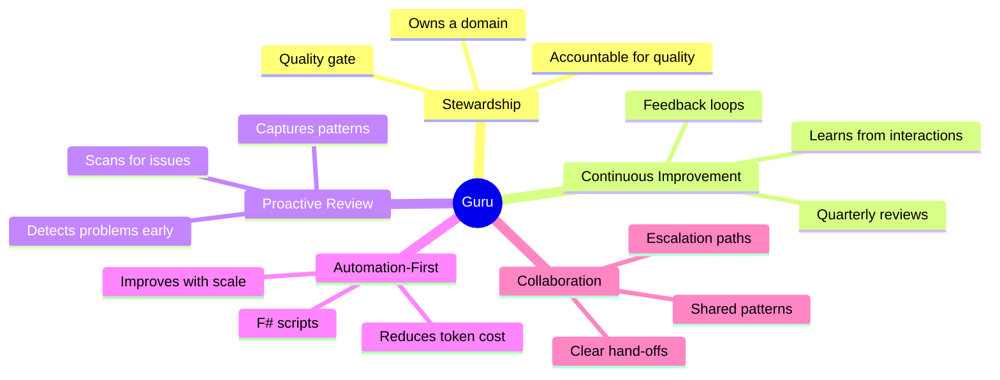
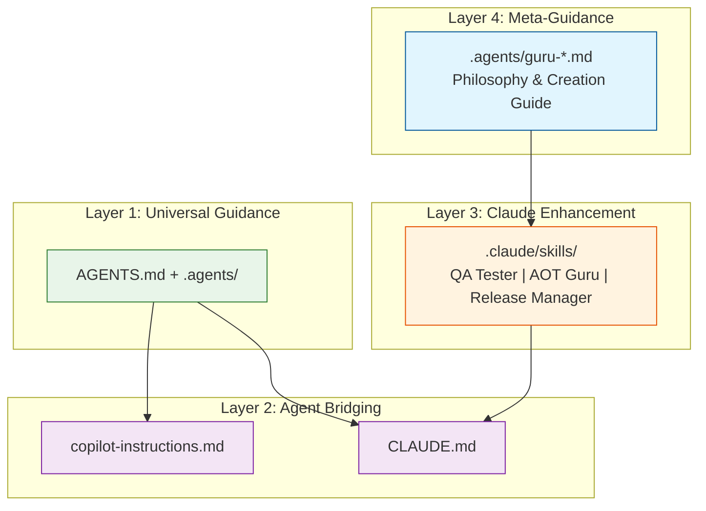
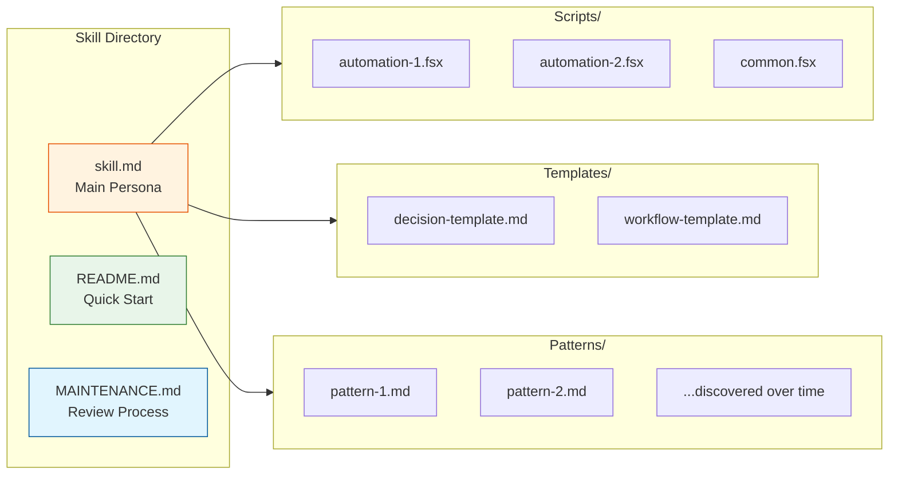
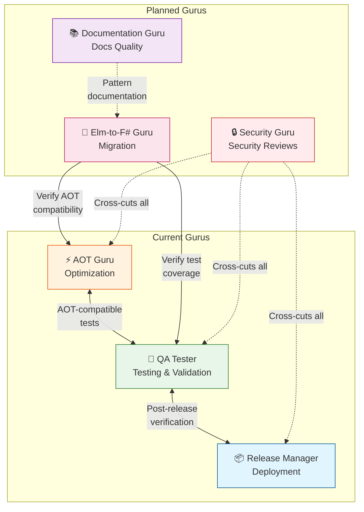
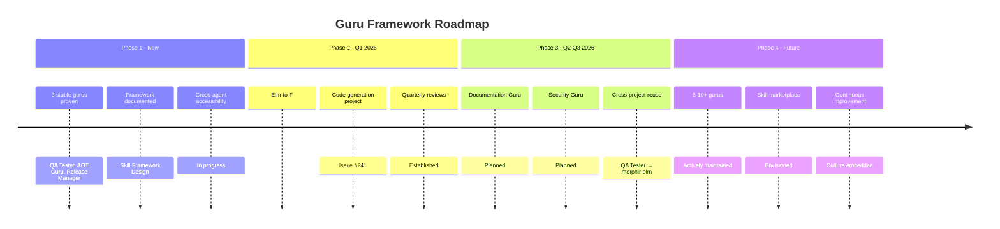

# AI Skill Framework Design

## Overview

This document establishes a comprehensive, scalable architecture for AI skills (known as "gurus" in this project) that work seamlessly across Claude Code, GitHub Copilot, and other coding agents. The goal is to create a repeatable pattern for developing specialized AI team members who improve continuously and provide expert guidance in specific domains.

## Motivation

The morphir-dotnet project has implemented three sophisticated gurus (QA Tester, AOT Guru, Release Manager) that provide specialized expertise through:
- **Decision trees** for problem-solving
- **Automation scripts** (F#) for repetitive tasks
- **Playbooks** for complex workflows
- **Templates** for common scenarios
- **Pattern catalogs** of domain knowledge

As the project plans to add more gurus (Elm-to-F# Guru, Documentation Guru, Security Guru, etc.), we need:
1. A clear definition of what makes a guru
2. Repeatable patterns for creation
3. Cross-agent accessibility (not Claude-only)
4. Continuous improvement mechanisms
5. Cross-project reuse strategy

## What is a Guru?

A **guru** is not a tool or a prompt. It's a **knowledge stewardship system** with these characteristics:



### Stewardship
- **Owns a domain** (Quality, Optimization, Releases, Migration, etc.)
- **Accountable** for quality, velocity, and responsibility in that domain
- **Maintains and evolves** best practices and decision frameworks
- **Acts as a quality gate** preventing regressions and anti-patterns

### Continuous Improvement
- **Learns from interactions** - Every session captures patterns and discoveries
- **Feeds back into guidance** - Playbooks, templates, and catalogs evolve
- **Automated feedback loops** (e.g., Release Manager retrospectives)
- **Quarterly reviews** ensure knowledge remains current

### Proactive Review
- **Scans the domain regularly** for issues, violations, and improvement opportunities
- **Detects problems before they escalate** - Review findings become preventative actions
- **Captures patterns and trends** - Quarterly reviews identify what's working and what's not
- **Feeds review findings into automation** - Patterns discovered 3+ times become scripts
- **Combines with retrospectives** for continuous improvement: Find problems → Fix them → Prevent them → Improve guidance

**Example:** AOT Guru's Quarterly Review
- Scans all projects for reflection usage (IL2026 patterns)
- Measures binary sizes vs. targets
- Reports: "3 new reflection patterns, 1 binary growing too fast"
- Actions: Update decision tree, create detection script, monitor closely

### Automation-First
- **Identifies high-token-cost tasks** - Repetitive diagnostics, testing, validation
- **Creates F# scripts** to automate these patterns
- **Reduces cognitive load** for future sessions
- **Improves with scale** - Every use makes the system smarter

### Collaboration
- **Coordinates transparently** with other gurus
- **Clear hand-offs** at domain boundaries
- **Escalates decisions** beyond scope to maintainers
- **Leverages shared patterns** from .agents/ guidance

### Example: Release Manager
The Release Manager guru exemplifies this philosophy:
- **Stewardship:** Owns release lifecycle and process consistency
- **Continuous Improvement:** Automated retrospective system captures feedback on failures/successes
- **Automation:** `monitor-release.fsx` polls autonomously, saving tokens per release
- **Collaboration:** Hands off to QA Tester for verification; coordinates with Elm-to-F# on version tracking

## Architecture

The skill framework is organized in layers, from universal guidance accessible to all agents down to Claude-specific enhancements.



### Layer 1: Universal Guidance (All Agents)

**Files:** `AGENTS.md`, `.agents/`

This layer provides tool-agnostic guidance applicable to all agents:
- Primary authority for coding standards, practices, philosophy
- Decision frameworks and playbooks
- Testing strategy, TDD workflow, quality standards
- Morphir IR principles and modeling
- Size: ~169 KB (AGENTS.md + 3 .agents/ guides)

**Audience:** Claude Code, GitHub Copilot, Cursor, Windsurf, Aider, Neovim+Codeium, human developers

### Layer 2: Agent-Specific Bridging

**Files:** `copilot-instructions.md` (Copilot), `CLAUDE.md` (Claude Code)

This layer provides agent-specific features and configuration:
- How to access universal guidance in each agent
- Agent-specific capabilities and limitations
- Links to skills and automation scripts
- Size: ~150 KB each (consolidated from 353 KB and 307 KB)

**Audience:** Copilot users and Claude Code users respectively

### Layer 3: Claude Code Enhancement

**Files:** `.claude/skills/`

This layer provides Claude-only specialization:
- 3 stable gurus: QA Tester, AOT Guru, Release Manager
- 1 planned: Elm-to-F# Guru
- Accessible via `@skill {skill-name}` syntax
- YAML metadata with trigger keywords
- Size: ~220+ KB for 3 skills, framework designed to scale to 5-10+

**Audience:** Claude Code users only

**Gurus:**
- **QA Tester** - Testing, validation, regression prevention (31 KB)
- **AOT Guru** - Optimization, trimming, AOT readiness (220 KB)
- **Release Manager** - Release lifecycle, deployment, recovery (104 KB)
- **Elm-to-F# Guru** (planned) - Elm-to-F# migration, code generation (TBD)

### Layer 4: Meta-Guidance (New)

**Files:** `.agents/guru-philosophy.md`, `.agents/guru-creation-guide.md`, `.agents/skill-matrix.md`

This layer guides the creation and evolution of gurus:
- Guru philosophy and principles
- Step-by-step creation guide
- Maturity and coordination matrix
- Success criteria and learning systems

**Audience:** Future skill creators, maintainers, all agents

## Skill Anatomy

Each guru skill follows a standard structure with well-defined components:



### Standard Components

Each guru skill consists of:

| Component | Purpose | Size | Audience |
|-----------|---------|------|----------|
| **skill.md** | Main persona, competencies, decision trees, playbooks | 1000-1200 lines (~50 KB) | Claude Code via @skill |
| **README.md** | Quick start guide, use cases, script reference | 300-400 lines (~16 KB) | All agents (readable on GitHub) |
| **Scripts/** | Diagnostic, testing, validation F# scripts | 3-5 scripts, 15-20 KB each | All agents (runnable via terminal) |
| **Templates/** | Issue templates, test templates, workflow templates | Variable | All agents (reusable) |
| **Patterns/** | Domain-specific pattern catalog | Cumulative | All agents (readable) |
| **MAINTENANCE.md** | Quarterly review process, feedback capture | 1-2 KB | Maintainers, skill evolvers |

### Token Budget

**Per-Skill Target:** 50-100 KB
- Preferred: 50-75 KB (efficient for context windows)
- Acceptable: 75-100 KB (comprehensive domains)
- Large: 100+ KB (complex domains, consider splitting)

**Rationale:**
- Claude Code has ~100K token context, can accommodate 200+ KB of skills
- GitHub Copilot has ~8K tokens for instructions; scripts must be external
- Other agents balance comprehensiveness with performance

### Automation Scripts

F# scripts should identify and automate high-token-cost repetitive work:

**Examples:**
- Release Manager's `monitor-release.fsx` - Autonomous workflow polling (saves tokens vs. manual polling)
- QA Tester's `smoke-test.fsx` - Quick validation in ~2 minutes (fast feedback loop)
- AOT Guru's `aot-diagnostics.fsx` - Automated problem analysis (reduces diagnostic overhead)

**Savings Analysis:**
- Diagnostic script that saves 100-200 tokens per use
- If used 5 times per quarter: 500-1000 tokens saved per quarter
- Over 1 year: 2000-4000 tokens saved
- If skill is 50 KB (~8000 tokens), script pays for itself in 6-12 months

## Guru Philosophy

### Core Principles

1. **Stewardship, Not Tooling**
   - Gurus own domains, not just answer questions
   - Improve with every interaction
   - Accountable for quality in their area

2. **Automate High-Token-Cost Work**
   - Identify repetitive diagnostic/testing/validation tasks
   - Create F# scripts to automate them
   - Reduce cognitive load for future sessions

3. **Learn from Every Interaction**
   - Document new patterns discovered
   - Update playbooks and catalogs
   - Feed improvements back into guidance

4. **Collaborate Transparently**
   - Clear hand-offs to other gurus
   - Explicit coordination points
   - Escalate when beyond scope

5. **Quality/Velocity/Responsibility Balance**
   - Maintain or improve code quality
   - Accelerate delivery through automation
   - Take responsibility for domain health

### Feedback Mechanisms

**Release Manager (Exemplar):**
- **Failure Retrospective:** When release fails, automatically prompt for feedback
  - Captures: "What went wrong?" and "How to prevent?"
  - Stores in tracking issue for pattern analysis
- **Success Feedback:** After 3+ consecutive successes, prompt for improvements
  - Captures: "What could we improve?" and "What automated?"
  - Feeds into playbook refinements
- **Process Change Detection:** When release procedures change, prompt for documentation updates

**Elm-to-F# Guru (Planned):**
- **Pattern Discovery:** Every migration discovers new Elm-to-F# patterns
  - Adds to pattern catalog if novel
  - Tags as "Myriad plugin candidate" if repetitive
- **Quarterly Review:** Assess patterns, create Myriad plugins for repetitive cases
  - Q1: Document new patterns
  - Q2: Create Myriad plugins (1+ per quarter target)
  - Q3: Update decision trees
  - Q4: Plan next quarter

**Template for New Gurus:**
- Identify feedback triggers (when to capture data)
- Define feedback storage (GitHub tracking issue, IMPLEMENTATION.md, etc.)
- Establish review schedule (quarterly, per-session, after N uses)
- Create improvement loop (feedback → updates → publish)

## Cross-Agent Compatibility

### Claude Code Users
- **Access:** `@skill {skill-name}` syntax activates guru
- **Context Window:** ~100K tokens, can load full skill.md + README.md + scripts overview
- **Benefit:** Natural invocation, deep expertise, triggers via keywords
- **Example:** User mentions "AOT warnings" → AOT Guru automatically invoked with decision trees

### GitHub Copilot Users
- **Access:** Read `.agents/` guides (universal guidance) + `.agents/skills-reference.md` (skill overview)
- **Automation:** Run scripts via terminal: `dotnet fsi .claude/skills/{skill}/script.fsx`
- **Context Window:** ~8K tokens for instructions; must reference external resources
- **Benefit:** Same patterns and automation scripts, different discovery mechanism
- **Example:** Copilot user reads `.agents/qa-testing.md` + runs `validate-packages.fsx` directly

### Other Agents (Cursor, Windsurf, Aider, etc.)
- **Access:** Read AGENTS.md and `.agents/` guides from GitHub
- **Automation:** Execute F# scripts directly using `dotnet fsi`
- **Context Window:** Varies (typically 4-20K for instructions)
- **Benefit:** Universal guidance, portable scripts, no vendor lock-in
- **Example:** Cursor user copies `.agents/aot-optimization.md` instructions into project context

### Capabilities Matrix

| Capability | Claude Code | Copilot | Cursor/Windsurf | Other Agents |
|------------|:-----------:|:-------:|:---------------:|:------------:|
| @skill syntax | ✅ Yes | ❌ No | ❌ No | ❌ No |
| YAML triggers | ✅ Yes | ❌ No | ❌ No | ❌ No |
| Read .agents/ | ✅ Yes | ✅ Yes | ✅ Yes | ✅ Yes |
| Run F# scripts | ✅ Yes | ✅ Yes | ✅ Yes | ✅ Yes |
| Decision trees | ✅ Full context | ⚠️ Manual reference | ✅ Yes | ✅ Yes |
| Context budget | 100K+ | 8K | 4-20K | 4-20K |

## Related Skills

The following diagram shows the current and planned guru ecosystem with their coordination relationships:



### Current Gurus

**QA Tester**
- **Domain:** Testing, validation, regression prevention
- **Competencies:** Test planning, automation, coverage tracking, bug reporting
- **Integration:** Coordinates with Release Manager for post-release verification
- **Token Cost:** 31 KB (skill + scripts)
- **Portability:** High (could apply to morphir-elm, morphir core)

**AOT Guru**
- **Domain:** Optimization, trimming, AOT readiness
- **Competencies:** Diagnostics, size optimization, source generators, Myriad expertise
- **Integration:** Coordinates with QA Tester for AOT-compatible test runs
- **Token Cost:** 220 KB (skill + 3 diagnostic scripts)
- **Portability:** High (portable if .NET versions of other projects emerge)

**Release Manager**
- **Domain:** Release lifecycle, deployment, recovery, process improvement
- **Competencies:** Version management, changelog handling, deployment monitoring, retrospectives
- **Integration:** Coordinates with QA Tester for post-release verification
- **Token Cost:** 104 KB (skill + 6 automation scripts)
- **Portability:** Medium (could adapt for mono-repo versioning)

### Planned Guru

**Elm-to-F# Guru** (#240)
- **Domain:** Elm-to-F# migration, code generation, pattern discovery
- **Competencies:** Language expertise, Myriad mastery, test extraction, compatibility verification
- **Integration:** Coordinates with AOT Guru for AOT compatibility of generated code
- **Token Cost:** TBD (target 50-100 KB)
- **Portability:** Medium (patterns portable, IR-specific knowledge less so)

### Future Candidates

**Documentation Guru**
- **Domain:** Documentation quality, API docs, examples
- **Competencies:** Technical writing, markdown standards, doc generation, accessibility
- **Integration:** Coordinates with Elm-to-F# for pattern documentation

**Security Guru**
- **Domain:** Security reviews, threat modeling, compliance
- **Competencies:** Vulnerability scanning, OWASP standards, authorization patterns
- **Integration:** Cross-cuts all gurus (every skill needs security review)

**Performance Guru**
- **Domain:** Benchmarking, profiling, optimization
- **Competencies:** Performance testing, bottleneck identification, optimization strategies
- **Integration:** Coordinates with AOT Guru on runtime performance

## Token Efficiency Strategy

### Problem
GitHub Copilot instruction file is at practical size limit (~28 KB, 56% of available tokens). Cannot add more content without removing something.

### Solution: Consolidation & Linking

1. **Remove Duplication** (~50 KB savings)
   - `copilot-instructions.md`: 353 → ~150 lines
   - `CLAUDE.md`: 307 → ~150 lines
   - Remove duplicated sections about TDD, conventions, Morphir modeling

2. **Cross-Reference Instead of Duplicate**
   - Copilot instructions → Link to AGENTS.md Section 9 (TDD)
   - CLAUDE.md → Reference .agents/ guides instead of duplicating content
   - Result: Free up 100-150 KB

3. **Automation Over Explanation**
   - High-token-cost work → F# scripts (Release Manager's polling script)
   - Complex decisions → Guidance docs
   - Result: Reduce explanation overhead

4. **Semantic Linking** (Copilot)
   - Include GitHub URLs to full guides
   - Copilot users can follow links for comprehensive details
   - Instructions remain under 8K tokens, full content accessible

### Example: Release Manager

**Before (Copilot):** Full playbooks (1200+ lines, 53 KB)
- All release workflows documented in instructions
- Exceeds Copilot token budget significantly
- Difficult to maintain

**After (Copilot):**
- Overview in instructions (~500 lines, ~20 KB)
- Link to `.claude/skills/release-manager/skill.md` for details
- Link to `.agents/skills-reference.md#release-manager` for cross-agent access
- `monitor-release.fsx` handles polling autonomously (reduces explanation)
- Result: 60%+ token savings while maintaining capability

### Savings Calculation

```
Release Manager Skill:
- Playbook explanation: 1200 lines → 300 lines (75% reduction)
- Reason: Automation handles complex logic (monitor-release.fsx)
- Savings: 100-150 KB in copilot-instructions.md
- Tradeoff: Users must read .agents/skills-reference.md for full playbooks
- Benefit: Copilot users still get guidance, just discover it differently
```

## Cross-Project Reuse

### Portability Strategy

**Portable Skills:**
- **QA Tester** → morphir-elm, morphir core (testing patterns apply universally)
- **AOT Guru** → morphir-elm (if .NET port emerges)

**Partially Portable:**
- **Release Manager** → Could adapt for mono-repo versioning (CHANGELOG format may differ)
- **Elm-to-F# Guru** → Pattern catalog portable, IR-specific knowledge less so

### Reuse Checklist

When planning to use a guru in a new project:

- [ ] Understand skill's domain and scope
- [ ] Assess project-specific config needs
- [ ] Identify paths/repos that need adjustment
- [ ] Read "Adapt to New Project" section in skill README
- [ ] Test skill with sample scenario
- [ ] Document adaptations (if any)
- [ ] Report improvements back to origin project

### Example: QA Tester in morphir-elm

```
Original (.morphir-dotnet): `.claude/skills/qa-tester/`
├── skill.md - Core QA philosophy, no project-specific content
├── README.md - Scripts references can be adapted
└── scripts/
    ├── smoke-test.fsx - Paths would need adjustment
    ├── regression-test.fsx - Test command would change
    └── validate-packages.fsx - Package names would differ

Adapted (.morphir-elm):
├── Test: npm run test vs. dotnet test
├── Smoke: npm run build vs. dotnet build
├── Packages: npm packages vs. NuGet packages
├── Regression: Same BDD/TDD philosophy, different tech stack

Effort: 2-4 hours to adapt and test
```

## Future Expansion

### Roadmap



**Phase 1 (Now):**
- ✅ 3 stable gurus proven effective
- ✅ Skill framework documented
- 🚧 Cross-agent accessibility implemented
- 🚧 Guru creation guide created

**Phase 2 (Q1 2026):**
- Elm-to-F# Guru implemented (#240)
- Morphir.Internal.CodeGeneration created (#241)
- Skills integrated with code generation
- Quarterly review process established

**Phase 3 (Q2-Q3 2026):**
- Documentation Guru planned
- Security Guru planned
- First cross-project reuse (QA Tester → morphir-elm)
- Skill marketplace envisioned

**Phase 4 (Future):**
- 5-10+ gurus actively maintained
- Cross-project skill sharing established
- Guru coordination at scale proven
- Continuous improvement culture embedded

### Scaling Considerations

**Guru Coordination at Scale:**
```
Current (3 gurus):
QA Tester ↔ Release Manager ↔ AOT Guru

Future (7 gurus):
Documentation ← Elm-to-F# → AOT → QA ↔ Release
       ↓
   Security (cross-cuts all)
```

**Dependency Management:**
- Explicit coordination graph (who coordinates with whom)
- Hand-off protocols at boundaries
- Error handling for coordination failures
- Token budgets account for coordination overhead

**Feedback Loop Management:**
- Each guru's retrospective/review process documented
- Aggregated insights shared quarterly
- Cross-guru learning captured (patterns that cross domains)

## Success Criteria

### For the Framework

- [ ] Architecture document complete
- [ ] GitHub issues created for implementation
- [ ] Guru philosophy widely understood
- [ ] Skill creation guide enables new gurus
- [ ] 3 existing gurus assessed for alignment
- [ ] Cross-agent accessibility proven
- [ ] First new guru (Elm-to-F# #240) created using framework
- [ ] Quarterly review process established and running
- [ ] Token efficiency targets met (Copilot <30 KB)

### For New Gurus

- [ ] 3+ core competencies defined
- [ ] 3-5 automation scripts created
- [ ] 20+ patterns in catalog
- [ ] Feedback mechanism implemented
- [ ] Coordination points with other gurus explicit
- [ ] Cross-project portability assessed
- [ ] Quarterly review schedule established
- [ ] Cross-agent compatibility documented

## References

- [AGENTS.md](../../../AGENTS.md) - Primary agent guidance
- [CLAUDE.md](../../../CLAUDE.md) - Claude Code-specific guidance
- [copilot-instructions.md](../../../.github/copilot-instructions.md) - Copilot configuration
- [.agents/](../../../.agents/) - Specialized cross-agent guides
- [.claude/skills/](../../../.claude/skills/) - Skill implementations

## Related Issues

- #253 - Design: Unified Cross-Agent AI Skill Framework Architecture
- #254 - Implement: Cross-Agent Skill Accessibility & Consolidation
- #255 - Implement: Guru Creation Guide & Skill Template
- #240 - Create Elm to F# Guru Skill
- #241 - Create Morphir.Internal.CodeGeneration Project

---

**Last Updated:** December 19, 2025
**Maintained By:** @DamianReeves
**Version:** 1.0 (Initial Release)
