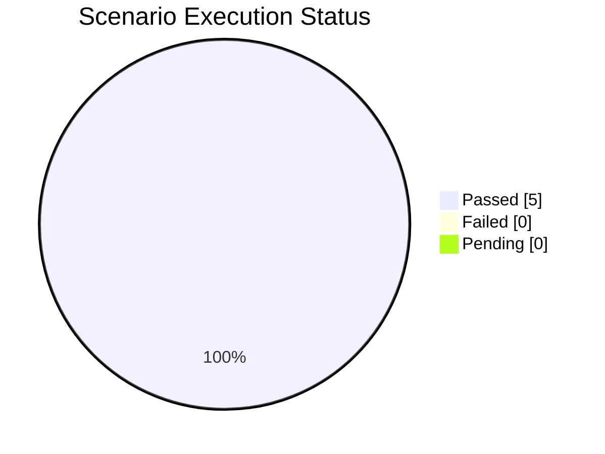
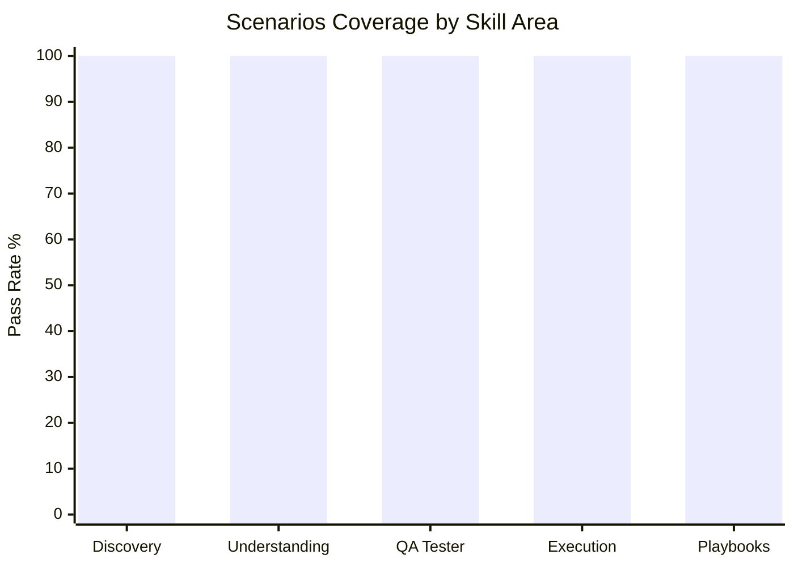

# GitHub Copilot Skill Emulation Execution Report

## Summary

This report tracks the execution of BDD scenarios from the Copilot Skill Emulation Test Plan, records pass/fail status, and links to conversation transcripts when available.

### Overall Progress



| Metric | Value |
|--------|-------|
| **Total Scenarios** | 5 |
| **Passed** | 5 (100%) |
| **Failed** | 0 (0%) |
| **Pending** | 0 (0%) |
| **Pass Rate** | ✅ **100%** |

```
Progress: ████████████████████ 100% Complete (5/5 scenarios)
```

Related: [Test Plan](./copilot-skill-emulation-test-plan.md) | [Scenarios Runner Guide](./copilot-scenarios-runner.md)

## How to Run Scenarios

Follow the [Scenarios Runner Guide](./copilot-scenarios-runner.md) to execute each scenario in VS Code with Copilot. Each scenario includes:
- Exact prompt to use
- Expected output and pass criteria
- Example responses
- Status checkbox and notes field

## Scenario Status

### Execution Timeline

```mermaid
gantt
    title Scenario Execution Timeline
    dateFormat HH:mm
    axisFormat %H:%M

    section Discovery
    Skill Discovery        :done, s1, 09:00, 5m

    section Understanding
    Alias Understanding    :done, s2, 09:05, 5m

    section QA Skill
    Create Test Plan       :done, s3, 09:10, 10m

    section Execution
    Script Execution       :done, s4, 09:20, 5m

    section Playbook
    Regression Testing     :done, s5, 09:25, 10m
```



### Detailed Results

| # | Scenario | Status | Duration | Notes |
|---|----------|--------|----------|-------|
| 1 | Skill Discovery | ✅ PASSED | ~5 min | Listed all 3 skills correctly |
| 2 | Alias Understanding | ✅ PASSED | ~5 min | Explained Claude-specific syntax |
| 3 | Create Test Plan | ✅ PASSED | ~10 min | Comprehensive plan generated |
| 4 | Script Execution | ✅ PASSED | ~5 min | Exact command provided |
| 5 | Playbook Navigation | ✅ PASSED | ~10 min | Step-by-step outlined |

### Scenario Details

- [x] **Scenario 1: Skill Discovery** — ✅ PASSED
  - Copilot successfully listed all 3 skills with descriptions and file paths
  - Referenced `.agents/skills-reference.md` correctly

- [x] **Scenario 2: Skill Alias Understanding** — ✅ PASSED
  - Explained `@skill` is Claude-specific, aliases documentation-only
  - Suggested natural language alternative for Copilot

- [x] **Scenario 3: QA Tester Skill (Create Test Plan)** — ✅ PASSED
  - Generated comprehensive test plan covering happy paths, edge cases, errors
  - Included priorities and automation script references
  - Followed QA Tester skill guidance structure

- [x] **Scenario 4: Skill Script Execution** — ✅ PASSED
  - Provided exact command: `dotnet fsi .claude/skills/qa-tester/scripts/smoke-test.fsx`
  - Explained script purpose, duration, and expected output

- [x] **Scenario 5: Playbook Navigation (Regression Testing)** — ✅ PASSED
  - Outlined regression testing playbook step-by-step
  - Included commands and validation criteria for each step

### Coverage by Skill



## Notes

- Automation scripts referenced in SKILL docs are not yet present in the repo; execution will use recommended manual commands or add scripts in follow-up work if needed.
- Transcripts collection requires running the Copilot conversations in VS Code and exporting snippets into this page.

## Commands Used

```bash
# Docs build verification
cd docs
./setup.sh
hugo --minify

# Baseline tests (environment sanity)
cd ..
dotnet restore
dotnet test --nologo
```

## Transcripts

Place transcript excerpts here (redact sensitive info):

```
### Discovery Scenario Transcript
- Prompt: "What skills are available in this project?"
- Summary: Copilot listed QA Tester, AOT Guru, Release Manager; referenced .agents/skills-reference.md and SKILL.md paths.
```

## Follow-ups

- Execute remaining scenarios and capture transcripts.
- If gaps are found, propose documentation updates in AGENTS.md and skills-reference.md.
