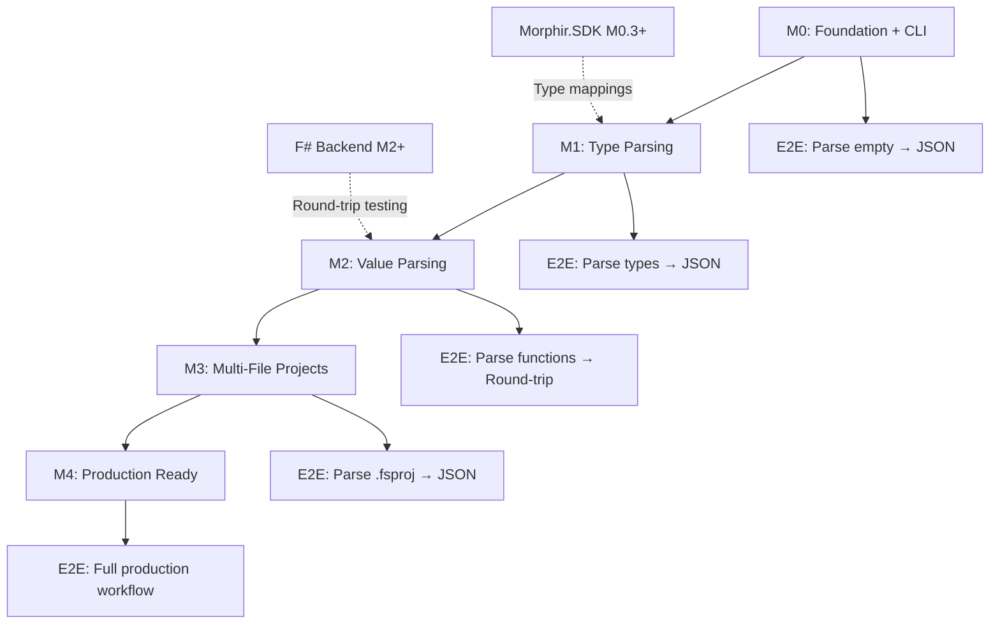

# F# Frontend Maturity Milestones

This document defines the incremental maturity milestones for the F# Frontend (F# → Morphir IR parser). Each milestone represents a demonstrable, testable level of functionality with **end-to-end CLI integration** from the start.

## Overview

The F# Frontend parses F# source code and generates Morphir IR. Unlike the F# Backend (which generates F# FROM IR), this component does the reverse - it parses F# TO generate IR, completing the round-trip capability.

**Architecture**: F# Source → FSharp.Compiler.Service → F# AST (Typed) → IR Mapper → Morphir IR → JSON

**Strategy**: Each milestone delivers a **thin vertical slice** with CLI integration, enabling end-to-end testing immediately.

## Milestone Progression

```
M0: Foundation + CLI (Weeks 1-2)
  ↓ End-to-end: Parse empty module → JSON
M1: Type Parsing (Weeks 3-5)
  ↓ End-to-end: Parse types → JSON → Validate
M2: Value Parsing (Weeks 6-8)
  ↓ End-to-end: Parse functions → JSON → Round-trip test
M3: Multi-File Projects (Weeks 9-10)
  ↓ End-to-end: Parse .fsproj → Unified JSON
M4: Production Ready (Weeks 11-12)
  ↓ End-to-end: Real-time diagnostics + Full feature set
```

---

## M0: Foundation + CLI (Thin Slice)

**Duration**: 2 weeks (Phase 1)
**Goal**: Minimal end-to-end pipeline: F# source → CLI → JSON output

### What Works

#### Core Infrastructure
- ✅ Parse valid F# source files using FCS
- ✅ Type-check F# source files
- ✅ Extract typed AST (`ParsedInput`)
- ✅ Report FCS diagnostics (syntax errors, type errors)
- ✅ Generate empty/minimal Morphir IR package

#### CLI Tool (Minimal)
- ✅ `morphir fsharp parse <file>` - Parse F# file
- ✅ `--output <file>` - Write JSON to file
- ✅ `--json` - Output JSON to stdout
- ✅ `--validate` - Validate only (no output)
- ✅ JSON output = Morphir IR v3 format
- ✅ Error reporting to stderr
- ✅ Exit codes (0 = success, 1 = error)

#### IR Generation (Minimal)
- ✅ Generate IR package with namespace
- ✅ Generate empty module definition
- ✅ Preserve module name and documentation
- ✅ Valid JSON schema (Morphir IR v3)

### End-to-End Example

```fsharp
// Input: EmptyModule.fs
namespace MyDomain

/// Empty calculator module
module Calculator =
    ()  // Empty module
```

```bash
# Parse to JSON
$ morphir fsharp parse EmptyModule.fs --json
{
  "formatVersion": 3,
  "distribution": {
    "Library": {
      "packageName": ["My", "Domain"],
      "packageDef": {
        "modules": {
          "Calculator": {
            "types": {},
            "values": {}
          }
        }
      }
    }
  }
}

# Parse to file
$ morphir fsharp parse EmptyModule.fs --output ir/calculator.json
✓ Parsed EmptyModule.fs → ir/calculator.json

# Validate only
$ morphir fsharp parse EmptyModule.fs --validate
✓ EmptyModule.fs is valid (0 errors, 0 warnings)

# Syntax error handling
$ morphir fsharp parse Broken.fs --validate
✗ Broken.fs:3:10: Unexpected token '}'
Exit code: 1
```

### Testing
- ✅ Unit tests for Parser module
- ✅ Unit tests for IRGenerator (empty modules)
- ✅ CLI integration tests (invoke actual CLI binary)
- ✅ Test error handling (syntax errors, missing files)
- ✅ Test JSON schema validation
- ✅ Test stdout vs file output modes

### Deliverables
- `src/Morphir.Frontends.FSharp/Parser.fs` - FCS integration
- `src/Morphir.Frontends.FSharp/IRGenerator.fs` - Minimal IR generation
- `src/Morphir.Frontends.FSharp.Cli/Program.fs` - CLI entry point
- `src/Morphir.Frontends.FSharp.Cli/ParseCommand.fs` - Parse command
- `tests/Morphir.Frontends.FSharp.Tests/ParserTests.fs`
- `tests/Morphir.Frontends.FSharp.Cli.Tests/E2ETests.fs`

### Success Criteria
- ✅ Can parse any valid F# file without crashing
- ✅ Generates valid Morphir IR v3 JSON
- ✅ CLI is scriptable: `morphir fsharp parse file.fs --json | jq`
- ✅ 100% test coverage for Parser + IRGenerator
- ✅ E2E tests pass (CLI invocation)

### Known Limitations
- ❌ No type definitions parsed yet (empty `types: {}`)
- ❌ No value definitions parsed yet (empty `values: {}`)
- ❌ Single file only (no .fsproj support)

---

## M1: Type Parsing (Thin Slice)

**Duration**: 3 weeks (Phase 2, part 1)
**Goal**: End-to-end type parsing: F# types → JSON → Validate schema

### What Works (Beyond M0)

#### Type Definitions
- ✅ Parse F# records → Morphir Record types
- ✅ Parse F# discriminated unions → Morphir Custom types
- ✅ Parse F# type aliases → Morphir Type aliases
- ✅ Extract field names, types, and documentation
- ✅ Handle recursive type references

#### Type Mapping
- ✅ Map primitive types (`int`, `string`, `bool`, `float`)
- ✅ Map collection types (`list<'T>`)
- ✅ Map `Option<'T>` → `Maybe a`
- ✅ Map `Result<'T, 'E>` → `Result e a`
- ✅ Map tuples (`'T1 * 'T2` → `(a, b)`)
- ✅ Map function types (`'T1 -> 'T2` → `a -> b`)
- ✅ Map generic type parameters (`'T` → `a`)

#### IR Generation
- ✅ Generate Morphir `Type.Definition` for records/DUs
- ✅ Generate fully-qualified names (FQName)
- ✅ Map F# namespace → Morphir package path
- ✅ Preserve documentation comments

#### CLI Enhancements
- ✅ `--pretty` - Pretty-print JSON (human-readable)
- ✅ Type definitions appear in JSON output
- ✅ Detailed diagnostics for type errors

### End-to-End Example

```fsharp
// Input: Types.fs
namespace MyDomain

/// Customer record
type Customer = {
    CustomerId: int
    Name: string
    Email: string option
}

/// Order status
type OrderStatus =
    | Pending
    | Confirmed of confirmedAt: System.DateTime
    | Shipped of trackingNumber: string
    | Cancelled
```

```bash
# Parse types to JSON
$ morphir fsharp parse Types.fs --json --pretty
{
  "formatVersion": 3,
  "distribution": {
    "Library": {
      "packageName": ["My", "Domain"],
      "packageDef": {
        "modules": {
          "Types": {
            "types": {
              "Customer": {
                "typeParams": [],
                "typeDef": {
                  "TypeAliasDefinition": {
                    "typeParams": [],
                    "typeExpr": {
                      "Record": [
                        {
                          "name": "customerId",
                          "tpe": { "Reference": [["Morphir", "SDK", "Basics"], "Int"] }
                        },
                        {
                          "name": "name",
                          "tpe": { "Reference": [["Morphir", "SDK", "String"], "String"] }
                        },
                        {
                          "name": "email",
                          "tpe": {
                            "Apply": {
                              "function": { "Reference": [["Morphir", "SDK", "Maybe"], "Maybe"] },
                              "arguments": [{ "Reference": [["Morphir", "SDK", "String"], "String"] }]
                            }
                          }
                        }
                      ]
                    }
                  }
                }
              },
              "OrderStatus": {
                "typeParams": [],
                "typeDef": {
                  "CustomTypeDefinition": {
                    "typeParams": [],
                    "constructors": [
                      { "name": "Pending", "fields": [] },
                      { "name": "Confirmed", "fields": [
                        { "name": "confirmedAt", "tpe": { "Reference": [["Morphir", "SDK", "DateTime"], "DateTime"] } }
                      ]},
                      { "name": "Shipped", "fields": [
                        { "name": "trackingNumber", "tpe": { "Reference": [["Morphir", "SDK", "String"], "String"] } }
                      ]},
                      { "name": "Cancelled", "fields": [] }
                    ]
                  }
                }
              }
            },
            "values": {}
          }
        }
      }
    }
  }
}

# Validate schema
$ morphir fsharp parse Types.fs --json | morphir verify --json
✓ Valid Morphir IR v3 JSON
```

### Testing
- ✅ Unit tests for TypeMapper module
- ✅ Property-based tests (F# type → IR → round-trip)
- ✅ Snapshot tests for complex types
- ✅ Test all primitive type mappings
- ✅ Test generic type parameters
- ✅ Test recursive types
- ✅ E2E tests: Parse types → Validate JSON schema

### Deliverables
- `src/Morphir.Frontends.FSharp/TypeMapper.fs` - Type mapping logic
- `src/Morphir.Frontends.FSharp/IRGenerator.fs` - IR generation (types)
- `tests/Morphir.Frontends.FSharp.Tests/TypeMapperTests.fs`
- `tests/Morphir.Frontends.FSharp.Tests/SnapshotTests/` - Approved snapshots
- `tests/Morphir.Frontends.FSharp.Cli.Tests/E2ETypeTests.fs`

### Success Criteria
- ✅ Can parse all MVP types from PRD
- ✅ JSON output passes `morphir verify` validation
- ✅ Round-trip test: F# type → IR → JSON → IR (equality)
- ✅ 100% test coverage for TypeMapper
- ✅ Snapshot tests for 20+ example types
- ✅ E2E CLI tests pass

### Known Limitations
- ❌ No value/expression parsing yet (`values: {}` still empty)
- ❌ No function implementations
- ❌ Single file only (no .fsproj support)

---

## M2: Value Parsing (Thin Slice)

**Duration**: 3 weeks (Phase 2, part 2 + Phase 3)
**Goal**: End-to-end value parsing: F# functions → JSON → Round-trip test

### What Works (Beyond M1)

#### Expression Mapping
- ✅ Parse literals (int, string, bool, float, char)
- ✅ Parse tuple expressions
- ✅ Parse list/array literals
- ✅ Parse record construction (`{ Field = value }`)
- ✅ Parse DU construction (`Some 42`, `Ok "success"`)
- ✅ Parse function application (`f x y`)
- ✅ Parse lambda expressions (`fun x -> x + 1`)
- ✅ Parse let bindings (`let x = 42`)
- ✅ Parse if-then-else expressions
- ✅ Parse match expressions (pattern matching)

#### Pattern Matching
- ✅ Parse literal patterns
- ✅ Parse wildcard patterns (`_`)
- ✅ Parse variable patterns (`x`)
- ✅ Parse tuple patterns (`(x, y)`)
- ✅ Parse record patterns (`{ Field = x }`)
- ✅ Parse DU patterns (`Some x`, `Ok value`)
- ✅ Parse list patterns (`[]`, `head :: tail`)
- ✅ Parse as-patterns (`x as value`)

#### Function Definitions
- ✅ Parse top-level function definitions
- ✅ Extract function name, parameters, return type
- ✅ Map function body to Morphir Value
- ✅ Handle curried functions
- ✅ Handle recursive functions (`let rec`)
- ✅ Handle mutually recursive functions

#### CLI Enhancements
- ✅ Function definitions appear in JSON (`values: {...}`)
- ✅ `--round-trip` - Validate round-trip: F# → IR → F# → IR

### End-to-End Example

```fsharp
// Input: Calculator.fs
namespace MyDomain

module Calculator =
    /// Add two numbers
    let add x y = x + y

    /// Factorial (recursive)
    let rec factorial n =
        match n with
        | 0 -> 1
        | n -> n * factorial (n - 1)

    /// Map option
    let mapOption f opt =
        match opt with
        | Some value -> Some (f value)
        | None -> None
```

```bash
# Parse to JSON
$ morphir fsharp parse Calculator.fs --json --pretty
{
  "formatVersion": 3,
  "distribution": {
    "Library": {
      "packageName": ["My", "Domain"],
      "packageDef": {
        "modules": {
          "Calculator": {
            "types": {},
            "values": {
              "add": {
                "valueType": {
                  "Function": [
                    { "Reference": [["Morphir", "SDK", "Basics"], "Int"] },
                    {
                      "Function": [
                        { "Reference": [["Morphir", "SDK", "Basics"], "Int"] },
                        { "Reference": [["Morphir", "SDK", "Basics"], "Int"] }
                      ]
                    }
                  ]
                },
                "valueDef": {
                  "Lambda": {
                    "argumentPattern": { "AsPattern": [{ "WildcardPattern": {} }, "x"] },
                    "body": {
                      "Lambda": {
                        "argumentPattern": { "AsPattern": [{ "WildcardPattern": {} }, "y"] },
                        "body": {
                          "Apply": [
                            {
                              "Apply": [
                                { "Reference": [["Morphir", "SDK", "Basics"], "add"] },
                                { "Variable": "x" }
                              ]
                            },
                            { "Variable": "y" }
                          ]
                        }
                      }
                    }
                  }
                }
              }
              // ... (factorial, mapOption)
            }
          }
        }
      }
    }
  }
}

# Round-trip test (requires F# Backend M2+)
$ morphir fsharp parse Calculator.fs --round-trip
1. F# → IR (frontend) ✓
2. IR → F# (backend) ✓
3. F# → IR (frontend) ✓
4. Compare IR₁ == IR₂ ✓
✅ Round-trip successful!
```

### Testing
- ✅ Unit tests for ValueMapper module
- ✅ Unit tests for PatternMapper module
- ✅ Property-based tests (expressions)
- ✅ Snapshot tests for complex functions
- ✅ Integration tests (complete modules)
- ✅ **Round-trip tests: F# → IR → F# (via backend) → IR**
- ✅ E2E CLI tests with `--round-trip` flag

### Deliverables
- `src/Morphir.Frontends.FSharp/ValueMapper.fs` - Expression mapping
- `src/Morphir.Frontends.FSharp/PatternMapper.fs` - Pattern matching
- `src/Morphir.Frontends.FSharp/ModuleMapper.fs` - Complete module mapping
- `src/Morphir.Frontends.FSharp.Cli/RoundTripCommand.fs` - Round-trip validator
- `tests/Morphir.Frontends.FSharp.Tests/ValueMapperTests.fs`
- `tests/Morphir.Frontends.FSharp.Tests/RoundTripTests.fs`
- `tests/Morphir.Frontends.FSharp.Cli.Tests/E2ERoundTripTests.fs`

### Success Criteria
- ✅ Can parse all MVP expressions from PRD
- ✅ Can parse complete F# modules (types + functions)
- ✅ **Round-trip test passes: F# → IR → F# → IR (95%+ success)**
- ✅ 100% test coverage for ValueMapper + PatternMapper
- ✅ Snapshot tests for 50+ example functions
- ✅ E2E CLI tests pass (including round-trip)

### Known Limitations
- ❌ No generics support yet (monomorphic only)
- ❌ No higher-order functions (beyond lambdas)
- ❌ Single file only (no .fsproj support)
- ❌ No Ionide analyzer yet

---

## M3: Multi-File Projects (Thin Slice)

**Duration**: 2 weeks (Phase 4)
**Goal**: End-to-end multi-file parsing: .fsproj → Unified JSON

### What Works (Beyond M2)

#### Multi-File Parsing
- ✅ Parse F# projects (.fsproj)
- ✅ Resolve file dependencies (compile order)
- ✅ Parse multiple source files
- ✅ Cross-file type references
- ✅ Cross-module function calls
- ✅ Generate single unified IR package

#### Imports & Dependencies
- ✅ Map F# `open` statements → Morphir imports
- ✅ Resolve qualified names (`Module.function`)
- ✅ Resolve type references across files
- ✅ Handle circular dependencies (error reporting)
- ✅ Map NuGet package references (Morphir.SDK)

#### Generics & Higher-Order Functions
- ✅ Parse generic type parameters (`'T`, `'a`, `'b`)
- ✅ Map generic functions to polymorphic IR
- ✅ Parse higher-order functions (`map`, `filter`, `fold`)
- ✅ Parse function composition (`>>`, `<<`)
- ✅ Parse partial application

#### CLI Enhancements
- ✅ `morphir fsharp parse <project.fsproj>` - Parse entire project
- ✅ `--output <dir>` - Write unified JSON to directory
- ✅ Dependency graph visualization (optional)

### End-to-End Example

```bash
# Project structure
MyProject/
  MyProject.fsproj
  Types.fs          # Customer, OrderStatus
  Calculator.fs     # add, factorial
  OrderProcessor.fs # processOrder (uses Types + Calculator)

# Parse entire project
$ morphir fsharp parse MyProject/MyProject.fsproj --output ir/
✓ Parsed 3 files
✓ Resolved 12 cross-file references
✓ Generated ir/MyProject.json (unified IR)

# Validate unified IR
$ morphir verify ir/MyProject.json
✓ Valid Morphir IR v3

# Round-trip entire project
$ morphir fsharp parse MyProject/MyProject.fsproj --round-trip
1. F# (3 files) → IR ✓
2. IR → F# (3 files) ✓
3. F# (3 files) → IR ✓
4. Compare IR₁ == IR₂ ✓
✅ Round-trip successful!
```

```fsharp
// OrderProcessor.fs (cross-file references)
namespace MyDomain

open MyDomain.Types       // Import from Types.fs
open MyDomain.Calculator  // Import from Calculator.fs

module OrderProcessor =
    let processOrder (order: Order) =
        let total = Calculator.add order.Subtotal order.Tax
        { order with Total = total }
```

### Testing
- ✅ Multi-file parsing tests
- ✅ Dependency resolution tests
- ✅ Cross-file reference tests
- ✅ Generic type inference tests
- ✅ Higher-order function tests
- ✅ E2E tests: .fsproj → IR → JSON → Round-trip
- ✅ Large project stress tests (50+ files)

### Deliverables
- `src/Morphir.Frontends.FSharp/ProjectParser.fs` - .fsproj parsing
- `src/Morphir.Frontends.FSharp/DependencyResolver.fs` - Multi-file resolution
- `src/Morphir.Frontends.FSharp/ImportMapper.fs` - F# `open` → Morphir imports
- `tests/Morphir.Frontends.FSharp.Tests/ProjectParserTests.fs`
- `tests/Morphir.Frontends.FSharp.Tests/MultiFileTests.fs`
- `tests/Morphir.Frontends.FSharp.Cli.Tests/E2EProjectTests.fs`

### Success Criteria
- ✅ Can parse multi-file F# projects (.fsproj)
- ✅ Generates valid unified Morphir IR JSON
- ✅ Round-trip tests pass for multi-file projects (95%+)
- ✅ 85%+ code coverage across all modules
- ✅ E2E CLI tests pass (project-level)
- ✅ NuGet package: `Morphir.Frontends.FSharp.Cli` (tool)

### Known Limitations
- ❌ No Ionide analyzer yet
- ❌ No VS Code extension
- ❌ Morphir.SDK types assumed (not validated at compile time)

---

## M4: Production Ready (Thin Slice)

**Duration**: 2 weeks (Phase 5)
**Goal**: Production-quality frontend with real-time diagnostics and complete documentation

### What Works (Beyond M3)

#### Ionide Analyzer
- ✅ Real-time diagnostics for unsupported features
- ✅ Error: Mutable bindings detected (`let mutable`)
- ✅ Error: Classes/OOP detected
- ✅ Error: Computation expressions detected
- ✅ Warning: Active patterns detected (future support)
- ✅ Info: Suggest Morphir-friendly alternatives
- ✅ VS Code integration (via Ionide)

#### Advanced Features (P1 from PRD)
- ✅ Generic constraints (`'T when 'T : comparison`)
- ✅ Recursive types (mutual recursion)
- ✅ Nested modules
- ✅ Module type annotations
- ✅ Record update syntax (`{ record with Field = value }`)
- ✅ List comprehensions (`[ for x in xs -> f x ]`)
- ✅ Partial application with placeholders

#### Quality & Performance
- ✅ Comprehensive error messages with source locations
- ✅ Performance benchmarks (parse 1000 LOC < 1s)
- ✅ Memory profiling (no leaks)
- ✅ Stress testing (large projects: 10K+ LOC)
- ✅ Compatibility testing (F# 8, 9, 10)
- ✅ CI/CD integration (GitHub Actions)

#### CLI Enhancements
- ✅ `--strict` - Enforce Morphir compatibility (exit on warnings)
- ✅ `--benchmark` - Show performance metrics
- ✅ `--watch` - Watch mode (re-parse on file change)
- ✅ Progress indicators for large projects

#### Documentation
- ✅ User guide: F# Frontend usage
- ✅ API documentation (XML docs)
- ✅ Language support matrix (supported vs unsupported)
- ✅ Migration guide (Elm → F# patterns)
- ✅ Troubleshooting guide
- ✅ CLI reference
- ✅ Ionide analyzer setup guide

### End-to-End Example

```fsharp
// VS Code with Ionide: Real-time diagnostics
module Calculator =
    let mutable counter = 0  // ❌ ERROR: Mutable bindings not supported by Morphir
                             //    Suggestion: Use immutable state + function parameters

    let add x y = x + y      // ✅ OK

    let (|Even|Odd|) n =     // ⚠️ WARNING: Active patterns not yet supported
        if n % 2 = 0 then Even else Odd
```

```bash
# Strict mode (fail on warnings)
$ morphir fsharp parse Calculator.fs --strict
❌ Calculator.fs:2:9: Mutable bindings not supported
⚠️ Calculator.fs:6:9: Active patterns not yet supported
Exit code: 1

# Performance benchmark
$ morphir fsharp parse LargeProject.fsproj --benchmark
✓ Parsed 10,000 lines in 847ms
✓ Generated 2.3MB IR JSON
✓ Memory usage: 145MB peak

# Watch mode
$ morphir fsharp parse src/ --watch --output ir/
👁️ Watching src/ for changes...
✓ Parsed Calculator.fs → ir/MyProject.json
[file changed: src/Calculator.fs]
✓ Re-parsed Calculator.fs → ir/MyProject.json
```

### Testing
- ✅ Ionide analyzer unit tests
- ✅ VS Code integration tests
- ✅ Performance benchmarks (baseline: 1000 LOC/sec)
- ✅ Stress tests (10K+ LOC projects)
- ✅ Compatibility tests (F# 8, 9, 10)
- ✅ Regression test suite (all examples from docs)
- ✅ E2E CLI tests (all flags and modes)

### Deliverables
- `src/Morphir.Frontends.FSharp.Analyzer/` - Ionide analyzer
- `docs/frontend/user-guide.md` - Complete user guide
- `docs/frontend/language-support.md` - Feature matrix
- `docs/frontend/cli-reference.md` - CLI documentation
- `docs/frontend/troubleshooting.md` - Common issues
- NuGet packages (see below)
- GitHub release with binaries

### Success Criteria
- ✅ 80%+ code coverage (maintained)
- ✅ All PRD acceptance criteria met
- ✅ Ionide analyzer functional in VS Code
- ✅ Documentation complete and accurate
- ✅ Performance: Parse 1000 LOC < 1s
- ✅ Round-trip tests pass (100% success rate)
- ✅ Zero known critical bugs
- ✅ E2E CLI tests pass (100%)

### NuGet Packages
- `Morphir.Frontends.FSharp` - Core library (parser + mapper)
- `Morphir.Frontends.FSharp.Cli` - CLI tool (dotnet tool)
- `Morphir.Frontends.FSharp.Analyzer` - Ionide analyzer

### Release Checklist
- [ ] All M0-M4 features implemented
- [ ] Test coverage ≥ 80%
- [ ] Documentation complete
- [ ] NuGet packages published
- [ ] GitHub release created
- [ ] Announcement blog post
- [ ] Update morphir.finos.org

---

## Beyond M4: Future Enhancements

These are **not** part of the initial scope but may be considered for future releases:

### P2: Extended F# Support
- ❌ Active patterns (simple)
- ❌ Units of measure (limited support)
- ❌ Quotations (code as data)
- ❌ Inline functions
- ❌ Member constraints

### P3: Tooling Enhancements
- ❌ VS Code extension (standalone, not via Ionide)
- ❌ LSP server (language server protocol)
- ❌ REPL integration
- ❌ Debugger integration
- ❌ Code coverage visualization

### Never Supported (By Design)
- ❌ Mutable state (`let mutable`, `ref`)
- ❌ Object-oriented features (classes, interfaces, inheritance)
- ❌ Computation expressions (async, seq, query)
- ❌ Type providers
- ❌ Side effects (IO, exceptions, printing)
- ❌ Advanced active patterns (parameterized, partial)
- ❌ Reflection
- ❌ Interop (P/Invoke, C# interop)

---

## Testing Strategy Per Milestone

| Milestone | Unit | Property | Snapshot | Integration | E2E CLI | Coverage Target |
|-----------|------|----------|----------|-------------|---------|----------------|
| M0        | ✅   | ❌       | ❌       | ❌          | ✅      | 100%           |
| M1        | ✅   | ✅       | ✅       | ❌          | ✅      | 100%           |
| M2        | ✅   | ✅       | ✅       | ✅          | ✅      | 90%            |
| M3        | ✅   | ✅       | ✅       | ✅          | ✅      | 85%            |
| M4        | ✅   | ✅       | ✅       | ✅          | ✅      | 80%+           |

**Note**: E2E CLI tests are present in **every milestone** to enable thin-slice validation.

### Round-Trip Testing

All milestones M2+ must pass round-trip tests via CLI:

```bash
# Round-trip flow
$ morphir fsharp parse source.fs --round-trip
1. F# Source (frontend parse)
   ↓
2. Morphir IR₁ (JSON)
   ↓
3. F# Source' (backend generate)
   ↓
4. Morphir IR₂ (frontend parse)
   ↓
5. Assert IR₁ == IR₂ ✅
```

---

## Dependencies Between Milestones



**Key Dependencies**:
- **M0 requires**: FSharp.Compiler.Service 43.9+, Morphir.Models (IR)
- **M1 requires**: M0 complete
- **M2 requires**: M1 complete, F# Backend M2+ (for round-trip testing)
- **M3 requires**: M2 complete, Morphir.SDK M0.3+ (type mappings)
- **M4 requires**: M3 complete, Ionide.Analyzers.SDK 0.9+

---

## Success Metrics Summary

| Milestone | Key Metric | Target | E2E Validation |
|-----------|------------|--------|----------------|
| M0 | Parse success rate | 100% (valid F# files) | Empty module → JSON |
| M1 | Type mapping accuracy | 100% (MVP types) | Types → JSON schema validation |
| M2 | Round-trip success | 95%+ (MVP features) | F# → IR → F# → IR |
| M3 | Multi-file parsing | 100% (.fsproj projects) | .fsproj → Unified JSON |
| M4 | Production readiness | 0 critical bugs, 80%+ coverage | All workflows + Ionide |

---

## CLI Evolution Across Milestones

| Command | M0 | M1 | M2 | M3 | M4 |
|---------|----|----|----|----|-----|
| `parse <file> --json` | ✅ Empty module | ✅ + Types | ✅ + Values | ✅ | ✅ |
| `parse <file> --output <path>` | ✅ | ✅ | ✅ | ✅ | ✅ |
| `parse <file> --validate` | ✅ | ✅ | ✅ | ✅ | ✅ |
| `parse <file> --pretty` | ❌ | ✅ | ✅ | ✅ | ✅ |
| `parse <file> --round-trip` | ❌ | ❌ | ✅ | ✅ | ✅ |
| `parse <project.fsproj>` | ❌ | ❌ | ❌ | ✅ | ✅ |
| `parse <file> --strict` | ❌ | ❌ | ❌ | ❌ | ✅ |
| `parse <file> --benchmark` | ❌ | ❌ | ❌ | ❌ | ✅ |
| `parse <file> --watch` | ❌ | ❌ | ❌ | ❌ | ✅ |

---

## References

- [PRD: F# Frontend](./PRD-fsharp-frontend.md) - Complete requirements
- [PRD: F# Backend](./PRD-fsharp-backend.md) - Backend design (for round-trip testing)
- [Morphir.SDK Library Plan](./morphir-sdk-library-plan.md) - SDK type mappings
- [F# Backend Maturity Milestones](./fsharp-backend-maturity-milestones.md) - Backend progression
- [Morphir IR Specification](https://github.com/finos/morphir) - IR format
- [FSharp.Compiler.Service](https://fsharp.github.io/fsharp-compiler-docs/) - Compiler API
- [Ionide Analyzers](https://ionide.io/Analyzers/) - F# analyzer SDK

---

**Document Status**: Draft
**Last Updated**: 2025-12-31
**Next Review**: After M0 completion
